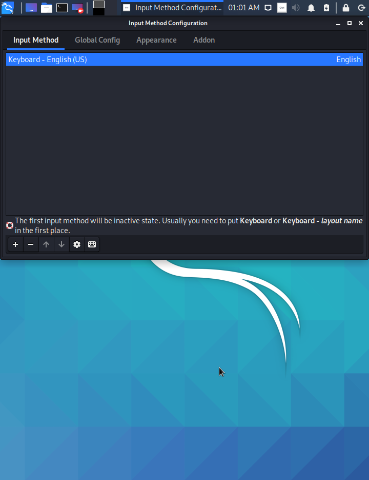

# 모의해킹이란?/실습환경 세팅   

***   


# 모의해킹

## 1. 모의해킹(Pen Testing) 이란?

: 시스템 장비, 네트워크 장비 등 실제 운영중인 서비스를 대상으로 공격자와 동일한 환경에서 여러 해킹 툴을 이용해 내부 시스템에 침투가 가능한지 테스트하는 작업.

- ※ 모의해킹은 크래킹과 같지 않다!

    모의해킹은 서로 합의가 된 상태에서 합법적으로 테스트 하는 것이고, 크래킹은 악의적인 목적을 가지고 서비스에 영향을 주는 것.
    

## 2. 모의해킹을 하는 이유?

: 모의해킹을 한다 = 보안에 신경을 쓴다

금융권, 쇼핑몰, 게임서비스 등의 상황에서 시스템이 다운될 경우 기업 이미지와 신뢰도, 재정에 상당한 타격이 생긴다.


## 3. 모의해킹 수행 표준(PTES)

**PTES(Penetration Testing Execution Standard)** : 모의해킹을 체계화된 방법으로 수행하기 위해 만든 표준. 7단계로 구성되어 있다.

1. 대상 선정(Pre-Engagement Interactions)

    모의해킹 수행 전에 고객과 진단 대상을 협의하는 과정.

2. 정보 수집(Intelligence Gathering)

    모의해킹을 수행하기 위한 진단 대상의 최대한 많은 정보를 수집.

3. 위협 모델링(Threat Modeling)

    조직의 내/외부적인 위협을 목록화.

4. 취약점 분석(Vulnerability Analysis)

    내부 시스템 침투를 수행하기 위해 자체 취약점을 분석하는 과정.

5. 공격(Exploitation)

    취약점을 이용해 내부 시스템 침투가 가능하다는 것을 증명, 공격 대상 시스템 침투 공격.

6. 후속 공격(Post-Exploitation)

    공격(exploit)이 성공한 후 수행하는 공격, 시스템 점령 후 공격자가 원하는 정보를 획득하려고 시도하는 과정.

7. 결과 보고(Reporting)

    최종 보고서 작성 및 대응책 제시


---


# Metasploit을 이용한 모의해킹

## Metsaploit Basics

**Metasploit** : 공격코드, 페이로더, 인코더, 정찰도구, 보안 테스팅 등을 제공하는 취약점 진단 및 공격 툴.

1) 주요 용어 정리

- Exploit :  취약점을 이용하여 목표로 하는 컴퓨터 시스템에 공격을 가하는 소프트웨어.
- Payload :  쉘코드, 취종 목적 코드, 취약점 공격이 끝난 후 추가적으로 수행하는 공격 코드(원격 명령 실행, 시스템 파괴 등)
- Shellcode : 시스템이 실행하기를 원하는 코드. 프레임워크에 의해 선택되고 전달된다.

    (ex) Reverse Shell은 타겟 머신으로부터 공격자까지 커넥션을 만들어주는 코드이다

    ※ Shellcode는 C, Ruby, Javascript 등 여러 포맷으로 만들어질 수 있다.

- Module : Metasploit Framework에서 사용될 수 있는 소프트웨어.

    (ex) exploit module, auxiliary module 등

- Listener : 연결 요청을 기다릴 수 있도록 해주는 기능. 공격 전 핸들러 설정, 바인드 커넥션, 리버스 커넥션

---

# 실습환경 세팅

## 1. Virtual Box 설치하기

우리가 모의해킹을 진행하기 위해서는 가상환경인 VirtualBox나 VMware을 설치해 주어야 한다. 우리는 VirtualBox를 이용할 것이다. 


.png)

구글 검색창에 'VirtualBox' 를 입력하거나, [www.virtualbox.org](http://www.virtualbox.org) 로 접속하여 Downloads 메뉴로 들어간다.


.png)

여기서 hosts란 본인이 사용하는 메인 OS를 뜻하는 것으로, Windows를 사용한다면 'Windows hosts'를, MacOS를 사용한다면 'OS X hosts'를 눌러 설치파일을 다운받는다.


.png)

Extension Pack도 다운받아 줘야 한다. 

페이지를 아래로 내려 VirtualBox Extension Pack을 발견한 뒤, 파란 글씨로 되어있는 'All supported platform'을 클릭하여 설치파일을 다운받는다.


.png)

.png)

다운받은 VirtualBox 설치파일을 눌러 설치를 시작한다.  설치가 완료되면 바로 실행한다는 체크박스를 해제하고 창을 종료한다.


.png)

아까 다운받았던 Extension Pack 설치파일을 누르면 위와 같이 뜨는데, '설치' 버튼을 눌러 설치를 진행해 주면 VirtualBox 설치가 완료된다.


## 2. Virtual Box에 Kali Linux 설치하기

Kali Linux는 고급 Pen Testing과 보안에 특화된 리눅스 환경으로, 수많은 정보 보안에 관련된 툴들을 포함하고 있다. 우리는 Kali Linux를 공격 시스템으로 이용할 것이다.


.png)

구글 검색창에 'Kali Linux'라고 입력하거나, 'www.kali.org'로 접속해 Downloads-Download Kali Linux탭으로 들어간다.


.png)

아래로 내려가다 보면 'Kali Linux ()bit Virtualbox' 를 발견할 수 있다. 본인의 pc 환경에 맞는 버전(64bit, 32bit)을 선택하여 'Offensive Security VM Download Page'를 클릭한다.


.png)

그러면 이러한 페이지가 나오는데, 'Kali Linux VirtualBox Images' 탭을 선택하고, 본인 pc에 맞는 버전의 파일을 다운받는다.


.png)

다운받은 Kali Linux 이미지파일을 더블클릭하면 자동으로 VirtualBox에서 가져오기 창을 띄운다. 그대로 가져오기 버튼을 눌러 Kali Linux를 VirtualBox에 설치한다.


.png)

Kali Linux가 다 설치되었다면 우클릭을 눌러 설정으로 들어간다.


왼쪽에서 '네트워크' 탭을 선택한 후, 네트워크 설정을 'NAT 네트워크'로 해 주고 확인 버튼을 누른다.


## 3. Kali Linux 기본 세팅하기

### **1) root 계정 진입 및 한글설정**


.png)

이제 Kali Linux를 실행해 보자. 처음에 로그인 화면이 뜰 것이다. 최신 버전 Kali Linux의 공용 계정의 ID/PW는 kali/kali 이다.


.png)

.png)

처음 접속하여 좌측 상단의 칼리리눅스 로고를 클릭하면 여러 인터페이스가 나온다. Web Browser을 클릭하여 우리가 흔히 사용하는 (한국)검색페이지에 접속해보면 한글이 모두 깨져서 나오는 걸 발견할 수 있다. 그렇기에 우리는 이제 한글을 깨지지 않게, 그리고 입력할 수 있도록 할 것이다.


.png)


최신 버전의 Kali Linux 에서는 로그인할 때부터 root 계정으로 접속하는 것이 불가능하다. 그렇기 때문에 터미널 창에서 따로 root 계정으로 진입할 수 있게 하여야 한다. 

- (1) 첫번째 방법으로는 root계정에 진입하기 위한 자신만의 패스워드를 설정하는 방법이 있다.

```
sudo passwd
[sudo]password for kali: kali
New password: [본인이 설정할 패스워드]
Retype new password: [본인이 설정한 패스워드 재입력]
passwd: password updated successfully
```

[password updated successfully]라는 문구가 뜨면 이제부터는 다음 커맨드를 통해 root계정으로 진입할 수 있다.

```
su -
Password: [본인이 설정한 패스워드]
```

- (2) 두번째 방법은 본인만의 패스워드를 설정하지 않고 root계정을 이용하는 방법이다.

```
sudo su -
[sudo]password for kali: kali
```

이 두 줄만으로 root계정에 진입할 수 있게 된다. 

이제 root계정을 사용할 수 있게 되었다면, 한글 설정을 할 수 있게 된다!


이제는 한글설정을 해 주어야 한다. 우선 root계정으로 전환한 다음 

```
~# apt-get update
~# apt-get install fcitx-hangul
~# apt-get install fcitx-lib*
~# apt-get install fonts-nanum*
init 6 
```

을 차례대로 입력하여 설치를 해준 다음, init 6을 사용해 재부팅 해준다.

이 때, fcitx-hangul과 fcitx-lib*을 설치할 때에는 [Do you want to continue? [Y/n]]라는 물음이 나오는데, 둘 다 y를 입력하여 설치를 진행해준다.


재부팅 후, 현재는 한글이 깨지지는 않지만 입력할 수는 없는 단계이므로 한글 입력 설정을 해 주어야 한다.

좌측 상단 아이콘을 클릭해 Input Method로 들어간다. 모두 동의를 눌러 넘어간다.


configuration 선택 창이 나오는데, 'fcitx'를 선택하고 OK를 누른다.





다시한번 메뉴에 들어가서 Fcitx Configuration을 클릭한다.

여기서 한글을 추가할 수 있는데, Method Configuration 창에서 하단의 + 버튼을 누르고 Only Show Current Language 체크박스를 해제한 후 Hangul을 입력한 뒤 OK를 누른다.

마지막으로 한/영 변환을 위해 Global Config창으로 들어가 Trigger Input Method에서 Ctrl+Space를 누른 후 한/영 버튼(혹은 RAlt)을 눌러 설정을 완료한다. 


### **2) 네트워크 설정**


이제는 Kali Linux의 네트워크 설정을 해 주어야 한다. 

메뉴창에서 'Advanced Network Configuration'을 클릭하여 들어가거나, 화면 우측 상단 시간표시 옆에 네트워크 버튼을 우클릭하여 'Edit Connections'로 들어갈 수도 있다.


그러면 Wired Connection 1 이라는 네트워크가 하나 뜨는데, 창 왼쪽 하단의 톱니바퀴 표시를 클릭해주고, IPv4 Settings로 들어가 위 사진과 같이 입력해준다.


이젠 네트워크 연결이 제대로 되었는지 확인해보자. 

터미널 창을 열어 root계정으로 진입한 후 다음과 같이 입력해준다.

```
~# ifconfig
```

그러면 현재 Kali 환경에서의 네트워크 정보를 확인할 수 있다.


혹시 모르니까 이중으로 확인해보자.

```
~# ping 8.8.8.8
```

이라고 터미널창에 입력하면 ping 테스트를 통해 해당 호스트와 통신이 가능한 상태라는 것을 확인할 수 있다.

이로써 Kali Linux 환경에서의 기본설정은 완료되었다.


## 4. VirtualBox에 Metasploitable2 설치하기

Metasploitable은 Metasploit에서 제공하는 취약한 환경이다. Windows에 비해 훨씬 취약하여 모의해킹 연습용으로 사용하기에 용이하다.

우리는 Metasploitable2를 사용할 것이다.


.png)

구글 검색창에 metasploitable2를 검색하여 나오는 링크들 중, SourceForge.net에서 제공하는 다운로드 사이트로 들어간다.

Download 버튼을 눌러 압축파일을 다운받고, 압축을 해제한다.


.png)

VirtualBox를 실행한 뒤, '새로 만들기'를 클릭하고 다음과 같이 입력한다.

이 때, 버전은 자신의 운영체제에 맞는 것으로 선택한다(32bit/64bit)


하드 드라이브 선택에서 '기존 가상 하드 드라이브 파일 사용'을 선택하고, 자신이 다운받은 Metasploitable2.vmdk파일을 선택해준 뒤 만들기를 클릭한다.


.png)

.png)

설치된 Metasploitable2를 우클릭하여 설정에 들어간 후, 네트워크 탭에서 'NAT 네트워크'를 설정해준다.


.png)

이제 Metasploitable2를 실행할 수 있다!

기본 ID/PW는 msfadmin/msfadmin 이다.


.png)

그럼 Metasploitable2 의 IP도 확인해보자.

```
~$ ifconfig
```

Kali Linux와 마찬가지로 ifconfig를 입력하면 IP를 확인할 수 있다.


## 5. VirtualBox에 Windows 설치하기

우리는 공격을 시행할 목표(victim) 환경으로 Windows XP와 Windows 8.1을 사용할 것이다.

Microsoft 홈페이지에서 Windows XP와 8.1 ISO 파일을 다운받는다.


### 1) Windows XP 설치

.png)

VirtualBox에서 '새로 만들기'를 누른다. 이름은 WinXP로 지정하고, 위와 같이 지정한다.


.png)

메모리 크기는 추천 메모리 크기 그대로 진행한다.


.png)

'지금 새 가상 하드디스크 만들기'를 선택하고 '만들기'를 누른다.

디스크 파일 종류는 VDI, 그 다음 동적할당을 선택하고, 가상 하드 디스크 만들기를 실행한다.


.png)

만들어진 WinXP를 선택하고, 우클릭하여 설정에 들어간다. 

[저장소]-[비어있음]을 선택하고, 광학 드라이브 옆 CD모양 그림을 우클릭하여 '가상 광학 디스크 선택/만들기'를 눌러 자신의 PC에 있는 Windows XP ISO 파일을 선택한다. 


.png)

네트워크 탭에서 마찬가지로 NAT 네트워크를 설정한다.


.png)

.png)

.png)

그리고 WinXP를 실행하면 드디어 설치가 시작된다.

차례대로 [Enter]=[F8]-[Enter]-[Enter] 순으로 입력하면 Windows XP 설치가 진행된다.


.png)

.png)

설치가 완료되면 계속 [다음]-[사용자 이름]-[Product Key] 순으로 입력한다.

그 다음 컴퓨터 이름과 날짜는 수정하지 않고 진행한다.


.png)

Windows XP가 업데이트 되며 몇분간의 시간이 소요된다.


.png)

업데이트가 완료되면 XP에서 자동으로 해상도를 설정한다.


.png)

.png)

마지막으로 권장사항인 자동 업데이트를 선택하고, LAN으로 인터넷 연결을 선택한다.


.png)

이제 Windows XP 설치가 완료됐다.

XP에서도 Metasploitable2 설치와 마찬가지로 IP를 확인하기 위해 cmd창을 열어 ipconfig를 입력해준다.

```
> ipconfig
```


### 2) Windows 8.1 설치

Windows 8.1 설치도 새 가상 하드디스크를 만들어 ISO 파일을 가상 광학 디스크에 선택한 후 네트워크 설정을 NAT 네트워크로 설정하는 과정까지는 Windows XP 설치와 동일하다.


.png)

VirtualBox에서 Win8.1을 실행한다.

위와 같이 Time and Currency를 Korean으로 설정한 뒤 Next를 누른다.


.png)

Product Key에는 Windows 8.1에 주어지는 Generic Key를 입력한다.


.png)

.png)

'Install Windows Only'를 선택한 후, 드라이브 설정은 그대로 둔 채 Next 버튼을 누른다.


.png)

.png)

.png)

PC 이름을 설정하면 Microsoft 계정을 생성할지 물어본다.

[Create a new account]-[Sign in without a Microsoft account]-[User name 설정] 순으로 적어주고 Finish 버튼을 눌러 설치를 진행한다.


.png)

Windows 8.1 설치가 진행된다. 시간이 다소 걸릴 수 있다.


.png)

Windows 8.1 설치가 완료됐다!

여기서 마찬가지로 IP를 확인하기 위해 cmd 창에 ipconfig를 입력한다.

```
> ipconfig
```

IPv4 Address 옆에 나타나는 IP가 우리가 사용할 Windows 8.1에서의 IP주소이다.


## ※ 네트워크 설정

우리가 Kali, Metasploitable2, Windows XP, 8.1에서 각각 네트워크를 모두 NAT 네트워크로 설정했지만, VirtualBox 환경설정에서 NAT네트워크가 만들어져 있지 않을 수 있다. 


.png)

VirtualBox에서 [파일]-[환경설정]-[네트워크] 탭에서 위와 같이 NatNetwork가 생성되어 있지 않다면, 새 NatNetwork를 추가해준다.

