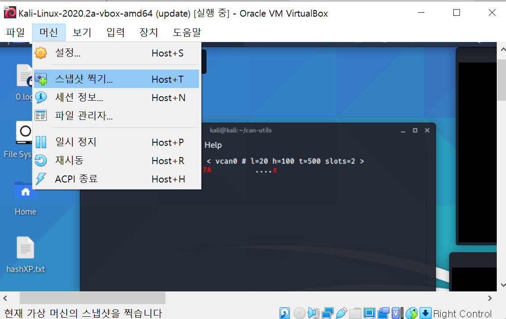

# Car Hacking

Kali linux와 packet sniffing을 활용하여 car hacking simulation을 해보자

자동차를 해킹하는 방법을 이해하기에 좋은 과정이다.

자동차 안에도 우리가 그냥 일반적인 네트워크에서 해킹을 하는 것처럼 많은 일들이 일어나고 있다.

method

- virtual controller area network 또는 tv cam에 연결
- controller area network를 kali에서 안전하게 시뮬레이션
- 실제 자동차 장치에 플러그인

실제로 car hacking을 위한 합법적인 오픈소스 툴들이 많이 있다. 그중에서 우리는 Craig Smith가 소속된 팀이 제작한 instrument cluster simulator(ICsim)를 이용할 것이다. 이는 실제 자동차에 있는 대쉬보드를 시뮬레이션한다. 

그리고 ICsim에도 여러 control들이 있는데, 심지어 플레이스테이션 컨트롤러를 가지고도 가상으로 자동차를 운전해 볼 수 있다. 그렇게 우리는 실제 자동차에서 경험할 수 있는 네트워크 트래픽을 시뮬레이션 할 수 있다. 

그러나 우리는 안전하게 진행해야 하기때문에 컴퓨터 환경과 칼리 리눅스를 이용할 것 이다.  Controller network를 시뮬레이션 하기 위한 모든 셋업들을 마치고, 마지막에는 케이블(CAN to USB)을 연결하여 여러 툴들과 소프트웨어를 이용해 실제 자동차에 사용할 것이다. 

엑셀을 밟거나, 좌우 깜빡이를 키거나 문을 잠그는 등의 일들을 컴퓨터 환경에서 진행 할 것이다. 그리고 실습 마지막에 player 커맨드를 이용하여  controller area network에서 컨트롤러에 손대지 않아도 기능이 작동하는 모습을 재생할 수 있을 것이다.  (이부분은 드라마나 영화에서 보이는 해킹과 유사한 부분이다.)

## 실습 전 준비

본격적인 설치에 들어가기 전에 깨끗한 칼리 상태를 스냅샷으로 찍어둔다.

머신 - 스냅샷 찍기


kali 를 업데이트해준다. 

```
kali@kali: ~$ sudo apt update
kali@kali: ~$ sudo apt upgrade
```

## 설치

- install a few dependencies:

칼리가 ICSim을 시뮬레이션 하기 전에 필요한 소프트웨어(cluster simulator 혹은 CAN utilis)

```
kali@kali: ~$ sudo apt install libsdl2-dev
kali@kali: ~$ sudo apt install libsdl2-image-dev
```

- download the ICSim tools to your home dir (~/) with git

깃헙으로부터 툴을 하나 다운받는다. 이것은 큰 팀으로 이루어진 여러 버전의 소프트웨어나 업무를 기억하고 유지하는 데 아주 휼륭한 툴이다. 

우리는 ICSim 제작자가 올려놓은 자료를 이용할 것이다.

```
kali@kali: ~$ cd ~
kali@kali: ~$ git clone https://github.com/zomebieCraig/ICSim.git
```

- install the can-utils

```
kali@kali: ~$ git clone https://github.com/linux-can/can-utils
kali@kali: ~$ cd can-utils
kali@kali: ~/can-utils$ make
```

can utils 컴파일한다.


- compile the ICSim tools using 'make'

다음으로는 ICSim 툴을 make를 이용해 컴파일 할 것이다.

우선 can-utils로부터 라이브러리 파일을 하나 복사해온다.(카피해온 파일을 새로운 ICSim에서 사용하기 위함이다)

```
kali@kali: ~/can-utils$ cp lib.o ~/ICSim //can-utils로부터 라이브러리 파일 복사
kali@kali: ~/can-utils$ cd ~/ICSim 
kali@kali: ~/ICSim $ make clean
kali@kali: ~/ICSim $ make
```


```
kali@kali: ~/ICSim $ ls //다운로드된 목록확인 
```

※ setup_vcan.sh 파일, controls 파일, icsim 파일은 색깔이 다르게 나타나는데, 이들은 executable file 이기 때문이다.

## Car Dashboard Simulator ICSim 실행하기

이제 우리는 car utility(that can utils)과  instrument cluster simulator(ICSim) 을 설치하였다. 실행해보도록 하자.

이제 우리는 virtual car network와 control area network를 Kali에 set up 할것이다. 그리고 IC Simulator를 실행할 것이다.(자동차 대쉬보드와 같은 형태) 또한 컨트롤러를 실행하고, can sniffer을 실행하여 패킷들이 controller area network에서 작동될 때 sniff할 수 있도록 할 것이다. 그리고 실행이 되면서도 우리에게 터미널창의 제어권을 주는 어플리케이션도 돌려볼 것이다.

- CAN network 실행

```
Kali@kali: ~/ICSim$ sh setup_vcan.sh //CAN network 시작(폴더위치 확인)
Kali@kali: ~/ICSim$ ip a  //네트워크 현황 확인
```

※ vcan.sh를 실행한 순간부터 우리는 Kali에서 실제 네트워크를 구동하고 있는 것이다.

vcan0라는 네트워크가 새로 생긴 것을 확인할 수 있다.  마지막에 link/can이라고 적힌 것은 control area network를 의미한다.


- run the icsim simulator

이제 ICSim을 실행해보자.

```
Kali@kali: ~/ICSim$ ./icsim vcan0 &  //icsim 시뮬레이터 실행
```

위 커맨드를 입력하면 창이 하나 뜨며 IC simulator가 실행되는데, 자동차의 대쉬보드 형태와 같다.

- run the controls

```
Kali@kali: ~/ICSim$ ./controls vcan0 & //control 시작
```

위 커맨드를 입력하면 조이스틱 형태와 같은 창이 하나 뜬다. virtual controller area network를 사용할 수 있게 된다.

→←↑↓

↑를 누르고 있으면 대쉬보드에서 자동차의 속력이 변하는 것을 확인할 수 있다.

→←키를 통해 깜빡이 기능을 조절할 수 있다.

RShift+A 로 문을 열고, LShift+A 로 문을 닫을 수 있다.

- run cansniffer

```
Kali@kali: ~/ICSim$ cd //canscniffer 시작
Kali@kali: ~$ ls
kali@kali: ~$ cd can-uitls/
Kali@kali: ~/can-utils$ ls
Kali@kali: ~/can-utils$ make install
Kali@kali: ~/can-utils$ sudo !!
Kali@kali: ~/ICSim$ cansniffer -c vcan0
```


cansniffer를 실행한 뒤, 방향키들을 입력했을 때 값이 어떻게 변하는지 확인한다.

ID 244 : accelerator 반응

ID 188 : 방향지시등 반응

## Capturing CAN traffic with CanSniffer

이제 can 유틸리티 컨트롤러, 네트워크 유틸리티, ICSim 시뮬레이터가 준비되었다.

→ Car Replay Attack을 할 준비가 되었다.

candump라는 controller area network 에서 패킷들을 capture하는 툴을 사용하는 방법을 익혀볼 것이다. 또한 canplayer로 replay하는 법도 배워보자.

```
kali@kali: ~$ cd ICSim/
kali@kali: ~/ICSim# candump -l vcan0 
```

위 커맨드를 입력한 후로 입력하는 모든 조작들이 기록된다.

컨트롤러를 클릭하고 키보드를 이용하여 대쉬보드 값을 마음대로 변경시켜 보자

기록을 중단하고 싶으면 ctrl c 를 누른다. 


조작을 다 했으면 터미널 창을 선택하고 ctrl + c 와 enter를 눌러 로그를 종료한다.

로그파일이 생성되었는지 확인하자

```
kali@kali:~/ICSim$ ls
```


candump 파일이 생성되었다. 

## The replay attack: replaying CAN packets with CANplayer

로그파일에 우리가 candump를 시작한 이후에 자동차에 변경된 모든 사항들이 기록되어있다. 우리는 이 로그파일을 이용하여 똑같이 replaying 해볼 것이다.

※ 혹시나 이 툴을 진짜 본인의 자동차에 적용해보고 싶은 사람은 절대로 다른 차량이나 사람이 있는 도로에서 사용하지 말 것!! 아무도 없고 넓은 곳에서 시도해보기를 바란다.

로그파일을 실행해보자

대쉬보드를 보면 candump이후 모든 변경된 사항이 차례로 실행되는 것을 확인할 수 있다.

```
kali@kali:~/ICSim$ canplayer -I candump-2020-07-3-_084311.log
```


## CAN Bus

우리는 이제까지 컨트롤러를 사용할 때 속도를 100까지밖에 올리지 못하였었다. 리미트를 해제하고 시속 280까지 올라갈 수 있도록 해 보자.

그리고 지금은 눈금이 올라가는 속도가 굉장히 느린 상태이다. 물론 현실반영을 하자면 이게 맞겠지만, 진짜로 운전을 하는 것이 아닌 우리에게는 답답하기 때문에 눈금이 올라가는 속도 또한 빠르게 해 볼것이다.

### Intro

- CAN(controller area network) bus 는 vehicle’s sensors 와 다양한 eletronic control units(ECUs) 와 연결될 수 있다.
- 시중에 판매되고 있는 차는 70개 이상의 ECU를 가지고 있다

(ex: engine, airbags, anti-lock brake, just priority value/ID)

bus : 통로 (address bus, data bus ..)

### Reverse Engineering the CAN(method)

- Send specific messages to the CAN bus:

→ cansend vcan0 188#02000000

- Controller window로 전환한뒤 커맨드를 원하는 옵션으로 고친다(accelerate, unlock doors, blinkers)
- 개인 CAN ID와 message value를 알린다
- ID와 message value값을  복사 붙여넣기, controller 끄기, cansend 이용하기

→ cansend vcan0 244#0000009999

→ cansend vcan0 19B#000000000000

→ cansend vcan0 188#03000000

(앞에 세 숫자는 CAN  ID, 해쉬테그 뒤에 숫자는 message value)

file system 으로는 c언어 파일이 수정 불가능하므로 kali/ICSim/control.c 파일을 수정하기 위해 메모장(leaf pad 혹은 nano 커맨드)을 사용하자.

```
root@kali: ~# apt-get install leafpad 
```


설치가 완료 되면 왼쪽 위 메뉴에서 'leafpad'를 연다.


leafpad의 상단바에서

File - Open 을 누른뒤 ICSim 폴더 안의 control.c 파일을 불러온다.

```
define MAX_SPEED 300.0
define ACCEL RATE 6.0
```

최대속력과 엑셀레이트를 각각 300과 6으로 수정한다.


control.c 파일을 저장 한 뒤 제대로 반영이 었는지 확인해보자 

새커맨드 창을 열어 ICSim 폴더로 진입한다.

```
kali@kali:~/ICSim$ ls
kali@kali:~/ICSim$ more controls.c
```

space 바를 누르면 controls.c 의 아랫쪽 내용도 확인할 수 있다.

leafpad에서 수정했던 라인이 바르게 수정되었는지 확인하자

확인했으면 ctrl c을 눌러 밖으로 나간다.

```
kali@kali:~/ICSim$ clear
```


```
kali@kali:~/ICSim$ ls
kali@kali:~/ICSim$ more Makefile
```

ls를 눌러 새롭게 생긴 log파일을 확인한다.


Makefile 안에는 컴파일링 된 파일들의 정보를 담고 있다.

```
kali@kali:~/ICSim$ make 
```

실행 하면 오류가 뜰 것이다 lib.o 

→ 재컴파일이 필요하다.(gcc = new complier)

```
kali@kali:~/ICSim$ gcc -g -O -c lib.c
kali@kali:~/ICSim$ ls -l
```

재컴파일 후 다시 make (모든 파일이 make 완료 될 때 까지 명령어 실행)

```
kali@kali:~/ICSim$ make
```

업데이트가 모두 끝났으니 다시 vcan simulator를 실행하자

루트계정으로 진입

```
root@kali:~/ICSim$ modprobe vcan
root@kali:~/ip link add dev vcan0 type vcan
root@kali:~/ip link set up vcan0
```

자 이제 모든 설정이 완료 되었다.

```
Kali@kali: ~/ICSim$ ./icsim vcan0 & //icsim 시뮬레이터 실행
```

새 커맨드 창을 열고 조이스틱 실행

```
Kali@kali: ~/ICSim$ ./controls vcan0 & 
```

결과 확인

이번에는 최대속력 600 accel rate 2로 설정하고 다시 실행해보자

다시 leafpad켜고 control.c 파일을 오픈하여 코드을 수정한다.


새로운 터미널 윈도우를 열자 

```
kali@kali:~$ cd ICSim
Kali@kali: ~/ICSim$ make
```

이제 설정이 완료 되었다. 

컨트롤러를 끄고 새로운 컨트롤러를 열어 제대로 수정되었는지 확인해보자.


***   

# Social Engineering   


## 소셜 엔지니어링이란?

## Cloning twitter and harvesting user passwords

우리는 소셜 엔지니어 툴킷의 하나의 서브메뉴에서 하나의 공격을 사용할 것이다. 이것은 굉장히 중요한 툴킷이다. 이번에 우리는 어떻게 spear-phishing을 찾아낼 수 있는지, 어떻게 spear-phishing을 멈출 수 있는지, 그리고 어떻게 다른 사람들에게 spear-phishing을 찾아내는 법을 가르칠지를 알아볼 것이다.

## 1. 소셜 엔지니어링 툴킷

자신에게 온 실제 이메일을 참고해보자. 어떤 것이든 username과 password가 같은 페이지에 나오는 것을 말이다. (예를 들어 페이스북) 이는 매우 중요한데, phishing 시도가 성공하려면 username과 password를 둘다 캡쳐해내야 하기 때문이다.

우선 시작하기에 앞서, 네트워크 환경을 NatNetwork로 맞춰주자.

소셜 엔지니어링 툴킷을 설치하기 위해서 왼쪽 상단 메뉴 - 13번 - social engineering toolkit을 클릭해주자.

쉘이 뜨면 yes를 눌러주고, 커맨드라인과 터미널이 뜨는 것을 확인할 수 있다.

우리는 이제 웹페이지를 복제해 볼 것이다.

※ 칼리 2020버전부터는 파이썬3을 지원하기 시작했다. 그래서 new python을 사용하려면 업데이트 셋을 설치해줘야 한다.  만약 오류가 생긴다면, 아래 두 커맨드를 입력해주자.

```
sudo sed -i 's/import cgi/import cgi, html/g' /usr/share/set/src/webattack/harvester/harvester.py
sudo sed -i 's/cgi.escape/html.escape/g' /usr/share/set/src/webattack/harvester/harvester.py
```

## 2. 웹페이지 복제하기


1번-2번(website attack)-3번(credential harvester)-2번(site cloner)

그러면 ip를 설정하라는 문구가 뜨는데, 우리는 여기서 fake 웹페이지를 칼리 서버에서 돌릴 것이다. 칼리 리눅스는 웹서버 역할을 하게 된다.


네트워크 확인을 위해 웹사이트에 ping테스트를 해보자.

```
ping www.google.com
```

그런다음 원래 터미널창으로 돌아와서, ip가 칼리 ip로 적혀있다면 엔터를 치고, 아니라면 입력해준 후 엔터를 친다.


url을 입력하라고 한다. twitter 로그인페이지를 적어주자.(다른 어떤 주소를 적어줘도 좋다.)

※ 실제로 웹사이트들은 수많은 업데이트가 이루어지고 있으므로 첫시도에 실패할 수도 있다. (facebook 실패) 그러니 로그인 페이지를 바로 입력하는 것으로 해 보자.

username과 password가 있는 페이지를 사용하면 가장 좋다고 나온다. 지금 이 툴킷이 로그인 페이지를 찾고 있는 것이다. 그리고 포트 80번을 이용한다고 나온다.

웹페이지가 열리기까지 조금 시간이 걸린다.


웹브라우저에서 localhost로 들어간 후, 로그인 페이지에서 이메일과 비밀번호를 입력한다.(본인의 계정) 그리고 터미널창을 확인해보면, 우리의 이메일과 패스워드가 유출되었다는 메시지가 뜨게 된다.

## Crafting the perfect spear-phishing email

우리는 앞에서 소셜 엔지니어링 툴킷을 이용하여 로그인 과정에서 입력하는 이메일과 비밀번호를 스캔해오는 과정을 실습해봤다.

```
ifconfig //kali ip확인
```
